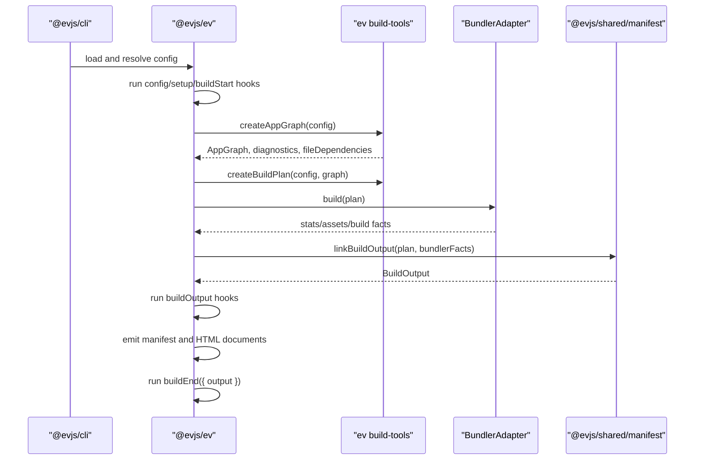

# Architecture

This file summarizes the current implementation. User-facing architecture
documentation lives in [docs/docs/architecture.md](./docs/docs/architecture.md)
and the current status matrix lives in [ROADMAP.md](./ROADMAP.md).

## Overview

evjs is a React framework whose framework-managed application model is
file-convention first. Client pages come from `src/pages`, server request
routes come from `src/apis`, middleware comes from `src/middleware.ts` and
`src/apis/**/middleware.ts`, and `"use server"` modules provide server
functions. `@evjs/client` and `@evjs/server` are independent runtime cores that
provide browser/server primitives without becoming alternate framework
configuration modes.

```txt
src/pages + src/apis + src/middleware.ts + ev.config.ts
  -> AppGraph
  -> BuildPlan
  -> selected bundler adapter
  -> BuildOutput / dist/server/manifest.json or dist/manifest.json
  -> client runtime, server runtime, deployment adapters
```

Framework semantics are owned by `@evjs/ev` and `@evjs/shared/manifest`.
Bundlers own module graphs, chunks, assets, dev HMR, and stats. Runtime packages
consume `BuildOutput` rather than raw bundler stats.

## Package Shape

```txt
@evjs/cli
  CLI and programmatic command entrypoints

@evjs/create-app
  project scaffolding and template restoration

@evjs/ev
  composition/control plane for config, plugins, graph analysis, build
  planning, HTML, capability validation, deployment helpers, and bundler
  adapter contracts

@evjs/shared
  runtime shared helpers and @evjs/shared/manifest schemas/linkers

@evjs/client
  browser runtime core for standalone CSR/manual routing, framework-managed
  page runtime, server-function transport, page hooks, navigation helpers, and
  RSC client runtime

@evjs/server
  server runtime core for server functions, REST routes, request context,
  SSR/PPR/RSC request coordination, and runtime adapters such as
  @evjs/server/node

@evjs/bundler-utoopack
  default Utoopack adapter

@evjs/bundler-webpack
  validation/fallback adapter for architecture features blocked on Utoopack APIs
```

`@evjs/ev` owns config, plugin, build, and deployment APIs, and composes runtime
capabilities through graph analysis, build plans, and manifest validation.
Runtime APIs live in `@evjs/client` and `@evjs/server`, and applications that
use those capabilities declare those runtime packages directly. Browser-only
CSR apps can use `@evjs/client` without depending on `@evjs/ev`. Other packages
are tooling, bundler adapters, or shared contracts for framework packages. When
a new capability needs a boundary, prefer adding a subpath export to the
package that owns the behavior before creating another distributed package.

Subpath exports stay explicit and documented; adding a new package export is a
public API decision, not a convenience alias.

Internal `@evjs/*` runtime dependencies are kept explicit and workspace-local.
`@evjs/ev` consumes shared contracts but does not publish runtime
subpaths. `@evjs/server` consumes `@evjs/client` for shared runtime types.
`@evjs/cli` owns the default Utoopack adapter dependency, and bundler adapters
depend on `@evjs/ev` instead of depending on each other. Internal runtime
dependency versions stay `"*"` in source manifests for workspace development,
then release automation rewrites them to the concrete release version before
publishing.
`@evjs/ev` exports stay limited to framework and build tooling entries.

Do not reintroduce legacy split packages:

```txt
@evjs/build-tools  -> packages/ev/src/build-tools
@evjs/manifest     -> packages/shared/src/manifest
```

Build helpers are exported from `@evjs/ev/build-tools`, manifest contracts are
exported from `@evjs/shared/manifest`, and generated page/shell runtime
primitives stay behind generated-only `@evjs/client/internal/*` subpaths.

## Build-Time Flow



## Dev-Time Rule

Graph analysis may read static import closure for semantic discovery, but dev
watching must remain narrower than that closure. `fileDependencies` should
include explicit file-convention roots and framework marker files such as
`src/pages`, `src/apis`, discovered `middleware.ts` modules, `"use server"`,
and `"use client"`. Programmatic `@evjs/server` route declarations are runtime
code, not graph roots. Ordinary component and style edits stay in the bundler
HMR path.

HTML-only dev plan updates can be relinked from existing bundler stats. Dynamic
entry or server renderer changes require `BundlerDevController.updatePlan()`.
Webpack implements this validation path. Utoopack still needs the lower-layer
entry/server update API before it can support those changes without restarting
the bundler dev instance.

## Runtime Ownership

```txt
@evjs/client
  mounts standalone CSR apps and framework-managed React pages

@evjs/client/internal
  reads BuildOutput, activates app/page modules, preloads modules, and disposes
  lifecycles

@evjs/server
  owns server functions, standalone REST route primitives, SSR document
  rendering, PPR region rendering, and RSC Flight endpoint routing

deployment adapters
  translate BuildOutput to platform artifacts and bootstraps
```

TanStack Router is available through the `@evjs/client` standalone CSR surface
for manual browser apps. In framework-managed apps, `@evjs/ev` owns file-route
discovery and generated bootstraps, so page code uses `src/pages`, page hooks,
and navigation helpers instead of constructing route trees directly.

## Manifest

The framework output contract is `BuildOutput`. Builds serialize the complete
contract to:

```txt
dist/server/manifest.json
```

They also emit a browser-safe public manifest to `output.client` and a server
bundle manifest to `output.server`. Deployment plugins and platform adapters
should consume `BuildOutput`.

## Deployment

`@evjs/ev` exposes platform-neutral deployment artifact helpers plus
`nodeDeploymentAdapter()`. The Node adapter emits a production `dist/server.mjs`
that imports only Node built-ins, `@evjs/server/node`, and the generated server
bundle. Platform-specific adapters should consume `BuildOutput` instead of
reading bundler config or stats.

## Programmatic Preparation

`prepareFrameworkBuild()` is the supported core API for tools that need
framework semantics without running a bundler or emitting platform files. It
resolves config, applies page-routing defaults, initializes plugins, runs
`buildStart` hooks, reports graph diagnostics, and returns the resolved config,
graph file dependencies, plugin watch files, and an explicit `dispose()`
function. `AppGraph` and `BuildPlan` remain internal framework state.

This API intentionally stops before bundler execution, manifest emission, and
deployment adapter output.
