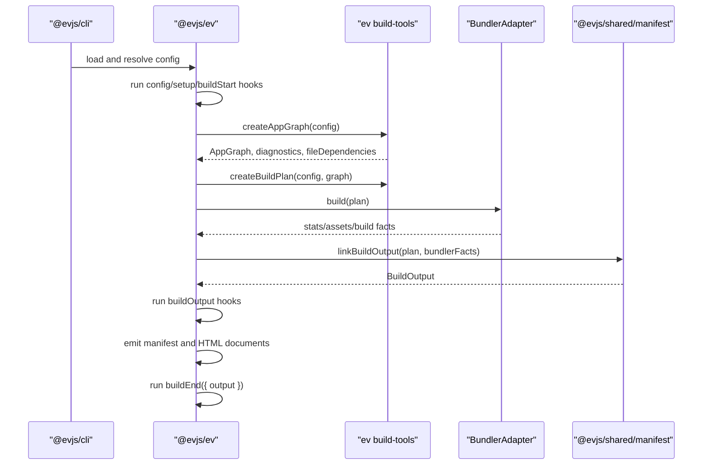

# Architecture

This file summarizes the current implementation. User-facing architecture
documentation lives in [docs/docs/architecture.md](./docs/docs/architecture.md)
and the current status matrix lives in [ROADMAP.md](./ROADMAP.md).

## Overview

evjs is a React framework whose framework-managed application model is
file-convention first. Client pages come from `src/pages`, server request
routes come from `src/apis`, framework request middleware comes from
`src/middleware.ts`, API route middleware comes from
`src/apis/**/middleware.ts`, and reachable `"use server"` modules provide
server functions. `@evjs/ev` exposes curated file-convention authoring subpaths
and generated-only internal bridges, while `@evjs/client` and `@evjs/server`
remain independent runtime cores that provide browser/server primitives without
becoming alternate framework configuration modes.

```txt
src/pages + src/apis + src/middleware.ts + ev.config.ts
  -> AppGraph
  -> BuildPlan
  -> selected bundler adapter
  -> in-memory BuildOutput
  -> ClientRuntime / FrameworkRuntime contracts
  -> DeploymentMetadata / lightweight manifests / deployment adapters
```

Framework semantics are owned by `@evjs/ev` and `@evjs/shared/manifest`.
Bundlers own module graphs, chunks, assets, dev HMR, and stats. Runtime packages
consume generated runtime contracts rather than `BuildOutput` or manifest
artifacts.

## Package Shape

```txt
@evjs/cli
  CLI and programmatic command entrypoints

@evjs/create-app
  project scaffolding and template restoration

@evjs/plugin-qiankun
  optional qiankun master/slave micro-frontend bridge plugin

@evjs/ev
  composition/control plane for config, plugins, graph analysis, build
  planning, HTML, capability validation, deployment helpers, and bundler
  adapter contracts, plus curated file-convention authoring subpaths

@evjs/shared
  runtime shared helpers and @evjs/shared/manifest schemas/linkers

@evjs/client
  standalone/manual browser runtime core, framework-managed page runtime,
  server-function transport, navigation primitives, and RSC client runtime

@evjs/server
  standalone/manual server runtime core for server functions, REST routes,
  request context, SSR/PPR/RSC request coordination, and runtime adapters such
  as @evjs/server/node

@evjs/bundler-utoopack
  default Utoopack adapter

@evjs/bundler-webpack
  validation/fallback adapter for architecture features blocked on Utoopack APIs
```

`@evjs/ev` owns config and plugin authoring APIs, with the root export limited
to minimal config authoring. Advanced config/plugin utilities, deployment
adapters, build tooling entries, and generated runtime bridges live on explicit
subpaths, and runtime capabilities are composed through graph analysis, build
plans, and manifest validation.
File-convention application source imports curated authoring APIs from
`@evjs/ev/route`, `@evjs/ev/navigation`, `@evjs/ev/query`, `@evjs/ev/server-context`, and `@evjs/ev/transport`; generated
framework code resolves runtime internals through `@evjs/ev/_internal/*`.
Runtime APIs in `@evjs/client` and `@evjs/server` remain standalone/manual
surfaces for applications that intentionally own those primitives directly.
Other packages are tooling, bundler adapters, or shared contracts for framework
packages. When a new capability needs a boundary, prefer adding a subpath export
to the package that owns the behavior before creating another distributed
package.
`@evjs/plugin-qiankun` is an explicit plugin-package boundary for qiankun
micro-frontend integration because it carries an optional third-party runtime
dependency and generated bridge behavior that should not become part of the
core framework surface.

Subpath exports stay explicit and documented; adding a new package export is a
public API decision, not a convenience alias.

Internal `@evjs/*` runtime dependencies are kept explicit and workspace-local.
`@evjs/ev` consumes `@evjs/client`, `@evjs/server`, and shared contracts so
file-convention apps can install one framework package while generated code
still reaches the runtime cores. `@evjs/server` consumes `@evjs/client` for
shared runtime types.
`@evjs/cli` owns the default Utoopack adapter dependency, and bundler adapters
depend on `@evjs/ev` instead of depending on each other. Internal runtime
dependency versions stay `"*"` in source manifests for workspace development,
then release automation rewrites them to the concrete release version before
publishing.
`@evjs/ev` root exports stay limited to minimal config authoring; advanced
config/plugin utilities, deployment helpers, and build tooling entries stay on
their own subpaths.

Do not reintroduce legacy split packages:

```txt
@evjs/build-tools  -> packages/ev/src/_internal/build
@evjs/manifest     -> packages/shared/src/manifest
```

Build helpers are exported from `@evjs/ev/_internal/build`, manifest contracts are
exported from `@evjs/shared/manifest`, and generated page/shell/server-function
runtime primitives stay behind focused generated-only
`@evjs/ev/_internal/*` subpaths.

## Build-Time Flow



## Dev-Time Rule

Graph analysis may read static import closure for semantic discovery, but dev
watching must remain narrower than that closure. `fileDependencies` should
include explicit file-convention roots and framework marker files such as
`src/pages`, `src/apis`, discovered framework/API middleware modules,
`"use server"`, and `"use client"`. Programmatic `@evjs/server` route
declarations are runtime code, not graph roots. Ordinary component and style
edits stay in the bundler HMR path.

HTML-only dev plan updates can be relinked from existing bundler stats. Dynamic
entry or server renderer changes require `BundlerDevController.updatePlan()`.
Webpack implements this validation path. Utoopack still needs the lower-layer
entry/server update API before it can support those changes without restarting
the bundler dev instance.

## Runtime Ownership

```txt
@evjs/client
  mounts standalone CSR apps and framework-managed React pages

@evjs/client/internal
  reads generated ClientRuntime, activates app/page modules, preloads modules,
  and disposes lifecycles

@evjs/server
  owns server functions, standalone REST route primitives, SSR document
  rendering, PPR region rendering, and RSC Flight endpoint routing

deployment adapters
  translate BuildOutput/DeploymentMetadata to platform artifacts and injected
  FrameworkRuntime bootstraps
```

TanStack Router is available through the `@evjs/client` standalone CSR surface
for manual browser apps. In framework-managed apps, `@evjs/ev` owns file-route
discovery and generated bootstraps, so page code uses `src/pages`, page hooks,
and navigation helpers instead of constructing route trees directly.

## Manifest

The framework output contract is the in-memory `BuildOutput`. Builds serialize
the canonical deployment projection to:

```txt
dist/build-output.json
```

They also emit compatibility deployment manifests to `output.client` and
`output.server`. The client manifest keeps public assets for SPA builds and
page-level assets plus routing for MPA builds. The server manifest keeps the
server entry and a lightweight projection of server-handled routes for existing
deployment integrations. Generated HTML embeds `ClientRuntime`, and runtime-only
`FrameworkRuntime` data is injected into dev or deployment adapter bootstraps
instead of being emitted as a default JSON artifact.

Deployment plugins and platform adapters should consume
`deploymentMetadata`/`createDeploymentArtifact()` for post-build routing and
assets. Plugins that need the complete graph can still inspect the in-memory
`BuildOutput`. Generated runtimes consume minimal `ClientRuntime` and
`FrameworkRuntime` contracts rather than manifest or build-output files.

## Deployment

`@evjs/ev` exposes platform-neutral deployment artifact helpers plus
`nodeDeploymentAdapter()`, `staticDeploymentAdapter()`, and
`edgeDeploymentAdapter()`. The Node adapter emits a production
`dist/server.mjs` that imports only Node built-ins, `@evjs/server/node`, and
the generated server bundle. Platform-specific adapters should derive platform
routes from `DeploymentMetadata` and the in-memory `BuildOutput` instead of
reading bundler config, stats, manifests, or runtime contracts.

## Programmatic Preparation

`prepareFrameworkBuild()` is the supported core API for tools that need
framework semantics without running a bundler or emitting platform files. It
resolves config, applies page-routing defaults, initializes plugins, runs
`buildStart` hooks, reports graph diagnostics, and returns the resolved config,
graph file dependencies, plugin watch files, and an explicit `dispose()`
function. `AppGraph` and `BuildPlan` remain internal framework state.

This API intentionally stops before bundler execution, manifest emission, and
deployment adapter output.
