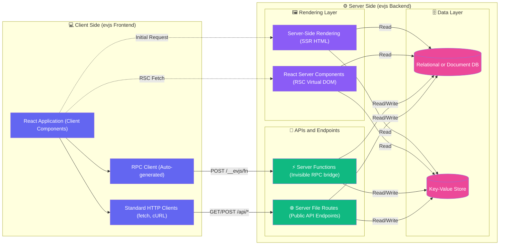

# evjs Overview

> High-level conceptual map of evjs features.

## Full-Stack Architecture

This graph maps out the **Client Side** and **Server Side**, illustrating how Rendering (SSR/RSC) and APIs (Server Functions/Route Handlers) operate within the backend before accessing your Data Layer.

