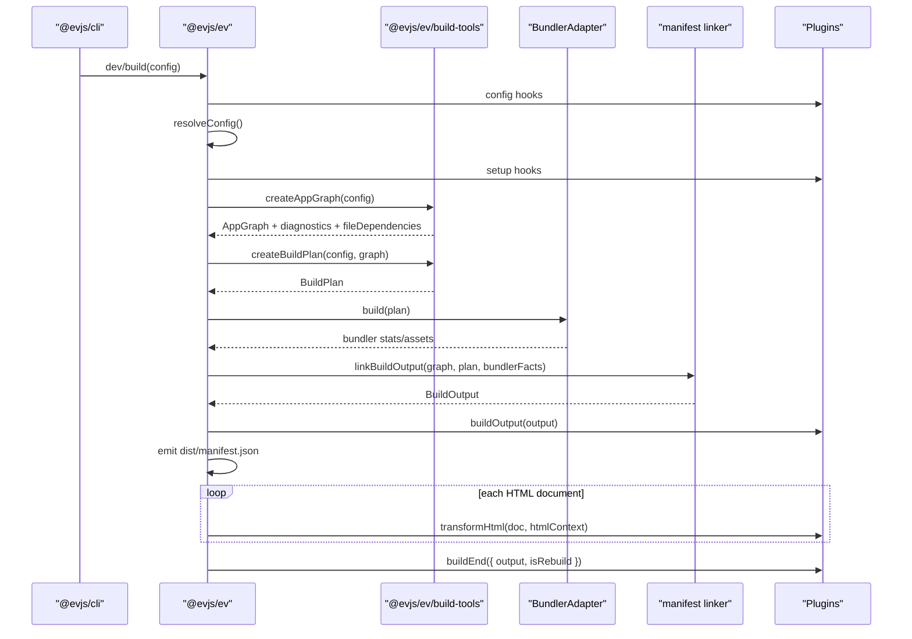
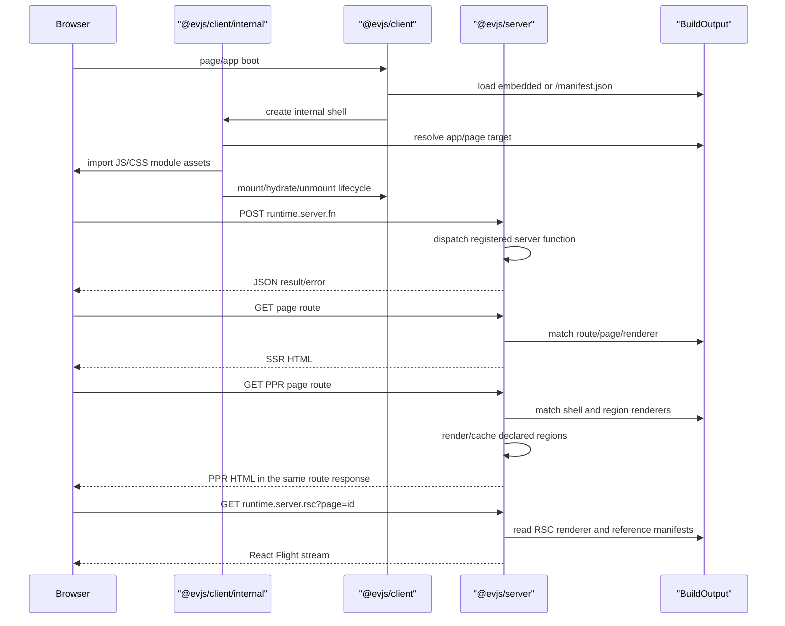
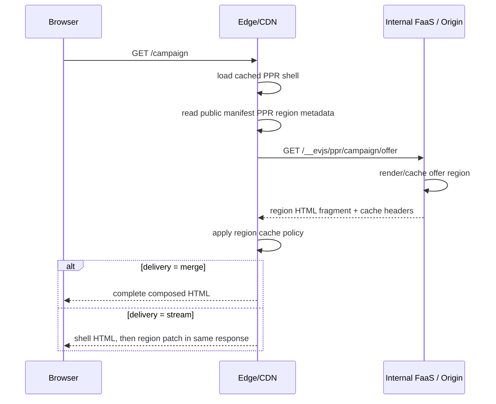

# Architecture

evjs is a React framework built around file-based page routes, explicit source
declarations, a framework graph, a bundler-independent build plan, and one
runtime manifest.

```txt
src/pages + ev.config.ts + server declarations
  -> AppGraph
  -> BuildPlan
  -> bundler build
  -> BuildOutput
  -> runtime / shell / deployment adapters
```

## Public Packages

Application code imports config, plugin, build, and deployment APIs through
`@evjs/ev`. Runtime APIs come from `@evjs/client` and `@evjs/server`, and apps
that use those capabilities should declare the runtime packages directly. Other
packages are tooling, bundler adapters, or shared contracts for framework
packages. When a new capability needs a boundary, prefer adding a subpath export
to the package that owns the behavior before creating another distributed
package.

```txt
@evjs/ev
  composition/control plane for config, plugin lifecycle, file-route
  discovery, dev/build orchestration, framework build types, capability
  validation, and deployment helpers

@evjs/client
  browser runtime core for standalone CSR/manual routing,
  framework-managed page runtime, server-function transport, page hooks,
  navigation helpers, and RSC client runtime

@evjs/server
  server runtime core for Hono/fetch apps, server functions, server routes,
  request context, and SSR/PPR/RSC request handling
```

`@evjs/cli` and `@evjs/create-app` are distribution tooling. Bundler adapters
stay in `@evjs/bundler-utoopack` and `@evjs/bundler-webpack`, and shared
runtime/manifest contracts stay in `@evjs/shared`. `@evjs/ev` decides which
runtime capabilities can be composed in one app through config resolution,
graph analysis, build-plan generation, and manifest validation; the runtime
packages provide the capability primitives.

| Role | Packages | Import guidance |
|------|----------|-----------------|
| Framework surface | `@evjs/ev` | Use `@evjs/ev` for config/build/plugin/deployment APIs and feature composition. |
| Runtime APIs | `@evjs/client`, `@evjs/server` | Use these packages for standalone CSR, page hooks, navigation, server functions, server routes, rendering, and deployment runtimes. |
| Tooling | `@evjs/cli`, `@evjs/create-app` | Install or execute them; application modules should not import them. |
| Bundler adapters | `@evjs/bundler-utoopack`, `@evjs/bundler-webpack` | `@evjs/cli` owns the default Utoopack adapter. Import an adapter directly only when authoring custom tooling. |
| Shared contracts | `@evjs/shared` | Published so framework packages share manifest/runtime types; app code should not import it directly. |

Published package manifests stay ESM-only and intentionally narrow. Every
distributed package sets `"type": "module"`, publishes with public access and
the MIT license, and whitelists generated output only: `esm` for framework,
runtime, adapter, and contract packages; `dist`/`bin` for `@evjs/cli`; and
`dist`/`templates` for `@evjs/create-app`.

Subpath exports stay explicit and documented; adding a new package export is a
public API decision, not a convenience alias.

Internal `@evjs/*` runtime dependencies are kept explicit. `@evjs/ev` consumes
shared contracts but does not publish runtime subpaths. `@evjs/server`
also consumes `@evjs/client` for shared runtime types. `@evjs/cli` owns the
default Utoopack adapter dependency, and bundler adapters depend on `@evjs/ev`
instead of depending on each other. Internal runtime dependency versions stay
`"*"` so release automation treats the distributed packages as one framework
version.

Generated-only `@evjs/client/internal/*` subpaths let framework-emitted
route declarations, page bootstraps, server-function stubs, and RSC runtime
entries type-check. Application code should keep importing standalone CSR,
navigation, page, transport, and RSC APIs from `@evjs/client` and should not
import generated-only internal helpers.
Examples include `@evjs/client/internal/route-types` for generated SPA
route declarations and `@evjs/client/internal/rsc-runtime` for RSC page
bootstraps.

Do not reintroduce legacy split packages such as `@evjs/build-tools`,
`@evjs/manifest`, or `@evjs/router-*`. Build helpers are exported from
`@evjs/ev/build-tools`, and manifest contracts are exported from
`@evjs/shared/manifest`.

Documentation code examples follow the same package boundary: application
examples import from `@evjs/ev`, `@evjs/client`, or `@evjs/server`;
adapter examples may import `@evjs/bundler-utoopack` when demonstrating custom
tooling.

## Internal Modules

```txt
@evjs/ev/build-tools
  source analysis, route/server-function extraction, graph/plan helpers,
  framework transforms, HTML helpers

@evjs/shared/manifest
  AppGraph, BuildPlan, BuildOutput, and manifest schemas

@evjs/client generated-only internals
  framework-managed runtime, shell, router-free react-page runtime, transport,
  RSC client runtime, SPA router integration, and generated bootstrap behind
  @evjs/client/internal/* subpaths backed by @evjs/client internals

@evjs/bundler-utoopack
  default bundler adapter used by @evjs/cli

@evjs/bundler-webpack
  validation/fallback adapter for SSR/PPR/RSC and dynamic entry/server
  dev plan updates while Utoopack lower-layer APIs catch up
```

`@evjs/ev/build-tools` does not import bundler adapters. Bundler adapters consume `BuildPlan`; they do not rediscover framework semantics from source files after bundling.
The `@evjs/ev/build-tools` subpath is intentionally limited to CLI and bundler
adapter tooling APIs. Low-level module export parsing, server-function ID
hashing, and module-ref helpers stay private to `@evjs/ev`.

## Build Flow



The manifest is `dist/manifest.json`. Legacy `dist/client/manifest.json` and `dist/server/manifest.json` are not the new framework contract.

TanStack Router is available through the `@evjs/client` standalone CSR surface
for manual browser applications. In framework-managed apps, `@evjs/ev` owns
file-route discovery and generated bootstraps, so page code uses `src/pages`,
page hooks, and navigation helpers instead of constructing router bootstraps
directly.

## Runtime Flow



PPR does not require the browser to fetch region endpoints during initial page
load. The framework server can use either `merge` or `stream` delivery for the
page route. `merge` is the default non-streaming mode and returns the final
server-composed HTML after shell and regions resolve. `stream` sends shell HTML
first, then sends region patches in the same document response. The derived
`runtime.server.ppr` endpoint remains available for direct/debug access and
cache validation.

In a single server process, region resolution is an internal framework call. In
an edge deployment, the same contract can split across layers: the edge can
serve a cached shell and resolve dynamic regions by server-to-server calls to an
internal origin/FaaS endpoint. The browser still sees only the page route:



That split means `GET /__evjs/ppr/...` may appear in edge-to-origin logs but not
in browser network logs. The long-term runtime boundary is a replaceable region
resolver: local Node/dev can call the renderer in-process, while edge adapters
can fetch an internal FaaS endpoint without changing the public page protocol.

The preferred PPR authoring model is React `Suspense` with a
`lazy(() => import(...))` child. The page component declares
`export const render = "ssr"` plus
`export const prerender = { partial: true, delivery }`. Dynamic regions can
declare `export const cache` and `export const hydrate` in their
own modules.
PPR is a prerendering strategy on top of SSR, not a separate document render
mode.

PPR page hydration is page-level `none` in the public manifest. Client
interactivity should be introduced through explicit client islands or
region-level hydration metadata, not by hydrating the whole PPR shell.

RSC uses the same `@evjs/server` boundary for Flight requests. The Flight
endpoint accepts `page=<id>` and an optional `url=<pathname+search>` value; that
`page` id must be a manifest page id using the build-identifier rule. The URL
context must be an absolute same-origin path or HTTP(S) URL and must not include
a hash.
The Webpack validation path uses React Flight client consumption and React
client/server reference manifests; Utoopack still needs equivalent lower-layer
metadata before it can run the same path.

## Configuration Ownership

```txt
routing
  page route source of truth: spa or mpa mode, dir, html, mount point

entry/html
  manual single app shorthand

pages.*
  explicit independent page output: path, entry/component/app, mount point

server.basePath
  derives framework server runtime paths: fn, ppr, rsc

transport.baseUrl
  browser-to-framework-server origin override

plugins
  framework and bundler extension points
```

`routing` points to `src/pages` by default. In SPA mode, graph creation turns
the discovered files into one internal TanStack Router app entry. In MPA mode,
the same files become independent page outputs without a client router.

Page modules own path-to-component wiring by filename and rendering metadata
through static exports such as `render`, `hydrate`, `rsc`, and `prerender`.
When graph creation sees SSR, RSC, or partial prerender metadata, it derives the
required server renderers, PPR regions, assets, and manifest output from that
page module.
Full server manifests keep those renderer relationships explicit: SSR, SSG, and
RSC document pages resolve through a `page-server` renderer owned by the page id
or by one of that page's route ids. PPR pages resolve through `ppr-shell` and
`ppr-region` entries instead.

`pages.*` remains the explicit lower-level page API. It is useful when a page
does not map cleanly to the `src/pages` file tree. Rendering metadata still
belongs in the referenced page module, not in `ev.config.ts`.

## Server Function Pipeline

```txt
"use server" module
  -> build-tools extraction
  -> client transform creates internal client references
  -> server transform/register path
  -> BuildOutput.server.functions
  -> framework server dispatches POST runtime.server.fn
```

The public config exposes `server.basePath`; the function endpoint is derived from that base path.

RSC `use client` reference extraction preserves default exports, identifier
exports, class exports, same-module aliases, namespace re-export names such as
`export * as Widgets from "./widgets"`, and re-exported names including
string-literal aliases in `BuildOutput.rsc`. Type-only exports are ignored. The
client reference transform emits internal bindings with export specifiers so
reserved words and string-literal aliases stay valid JavaScript.
`BuildOutput.rsc.clientReferences` and `BuildOutput.rsc.serverReferences` use
the extracted reference id as a trimmed string key. Those ids may contain file
paths, URL syntax, `#`, or `:`; the value object carries the trimmed `module`
and optional trimmed `exportName`.
Reference-only RSC output can omit `BuildOutput.rsc.endpoint`; RSC page output
cannot, because Flight requests need a concrete endpoint. The manifest linker
rejects RSC page output when `runtime.server.rsc` is missing.
For full server manifests, each RSC page renderer reference must resolve to an
`rsc-page` renderer whose `owner.pageId` matches the RSC page id; public
manifests may omit that server-only renderer metadata.
After ignoring type-only and ambient declarations, a `"use client"` module must
still expose at least one runtime client reference.
Bare runtime `export * from "./widgets"` is rejected because the framework
manifest must know every client reference export name; use explicit named
re-exports or a namespace re-export instead.
Malformed `"use client"` modules are reported during graph analysis with the
file path and parser message before the bundler transform runs.

## Deployment

Deployment adapters consume `BuildOutput`. `@evjs/ev` provides:

- `createDeploymentArtifact(output)` for platform-neutral routing/assets/server metadata;
- `nodeDeploymentAdapter()` for a concrete Node production target that emits
  `dist/deployment.node.json` and `dist/server.mjs`;
- `staticDeploymentAdapter()` for static-host routing metadata and `_redirects`;
- `edgeDeploymentAdapter()` for edge-worker style runtime bootstraps that call the
  framework server bundle and an asset binding.

Platform-specific adapters should derive their routing, framework endpoint, SSR,
PPR, RSC, and asset metadata from `BuildOutput`
instead of reading bundler stats.
Full server manifests retain source modules and server renderer references;
public/browser manifests keep the same routing and asset shape but redact those
server-only fields, so client-side validation treats them as optional.

The deployment model is capability-driven:

```txt
static-only
  CSR / MPA client entries / SSG / assets

unified node
  static assets + framework endpoints + SSR/PPR/RSC + server functions/routes

unified edge worker
  asset binding + edge-compatible framework server bundle

edge + origin/FaaS split
  edge caches assets/shells
  origin/FaaS resolves functions, routes, SSR/RSC, and PPR regions
```

Adapters should classify `BuildOutput` first, then emit platform routes. Static
hosting must not claim support for SSR, PPR, RSC, server functions, or server
routes unless a server-capable runtime is attached.

## Dev Updates

Framework-level declaration changes are handled separately from normal HMR:

```txt
config / page route / server declaration change
  -> recreate AppGraph
  -> recreate BuildPlan
  -> diff BuildPlan
  -> if BuildPlan changes:
       bundlerDevController.updatePlan(update, nextGraph)
  -> if graph-only:
       refresh active graph + dependency watchers
```

The default Utoopack adapter applies HTML-only plan updates by relinking
framework output from existing build stats. It still reports a clear unsupported
error for dynamic entry and server renderer updates until Utoopack exposes the
lower-layer API. The webpack adapter can apply those broader updates in-process
for architecture validation. Style and asset edits remain on the bundler HMR
path. Server-function and server-route implementation edits usually keep the
same `BuildPlan`; in that case the framework refreshes graph metadata and watch
inputs, while the bundler's normal server watch emits the updated code.

Graph analysis reads page route modules plus static import closures to discover
server functions, server routes, page metadata, and RSC references. Static import
closure discovery parses modules, so it follows ordinary imports, re-exports,
and valid string-literal import aliases. Literal dynamic imports are also tracked
when they point at project-relative modules. Dev watches the page route
directory, explicit graph roots, and files that already contain framework
markers. Configured page components are explicit graph roots because their
static `render`, `hydrate`, `rsc`, and `prerender` exports affect framework
planning. Ordinary component, app entry, and style edits stay on the bundler
HMR path unless those modules declare framework markers.
