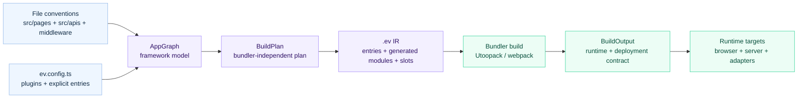
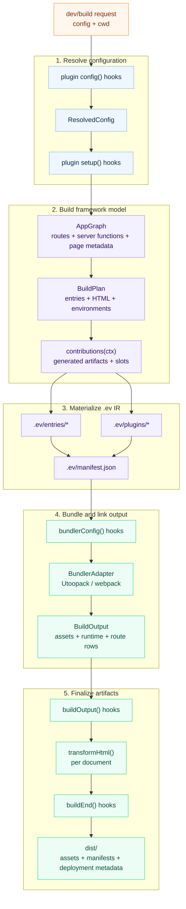
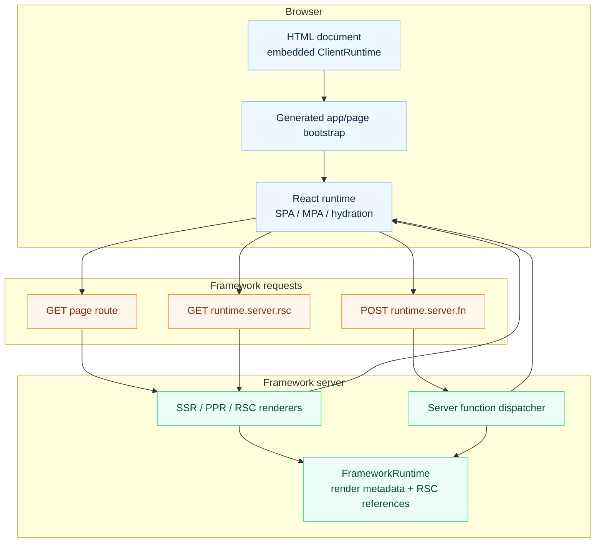
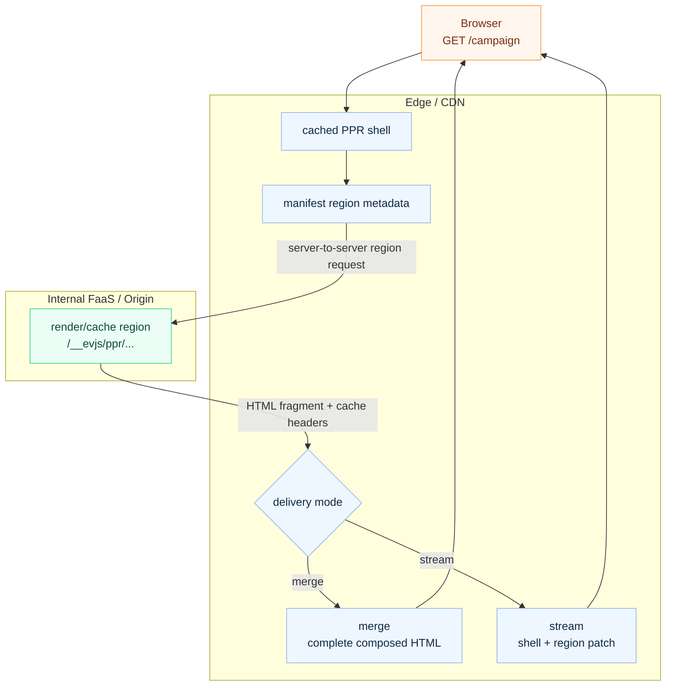

# Architecture

evjs is a React framework built around file conventions, explicit source
declarations, a framework graph, a bundler-independent build plan, and one
private build output contract with generated runtime projections. The
framework-owned route model is file-based: client pages come from `src/pages`,
server file routes come from `src/apis`, and server middleware is split between
framework request middleware in `src/middleware.ts` and API route middleware in
`src/apis/**/middleware.ts`.



## Public Packages

Application config files import the minimal config authoring API through
`@evjs/ev`. Advanced config utilities, plugin authoring types, deployment
adapters, and internal build/manifest helpers live on explicit subpaths.
File-convention apps import curated authoring APIs from
`@evjs/ev/route`, `@evjs/ev/navigation`, `@evjs/ev/query`, `@evjs/ev/server-context`, and `@evjs/ev/transport`; generated
framework code resolves client/server runtime internals through
`@evjs/ev/_internal/*`. `@evjs/client` and `@evjs/server` remain
standalone/manual runtime packages for apps that intentionally own those
surfaces directly. Other packages are tooling, bundler adapters, or shared
contracts for framework packages. When a new capability needs a boundary,
prefer adding a subpath export to the package that owns the behavior before
creating another distributed package.

```txt
@evjs/ev
  minimal config authoring entry: defineConfig plus config/plugin shape types

@evjs/client
  standalone/manual browser runtime core, framework-managed page runtime,
  server-function transport, navigation primitives, and RSC client runtime

@evjs/server
  standalone/manual server runtime core for Hono/fetch apps, server functions,
  route primitives, request context, and SSR/PPR/RSC request handling

@evjs/plugin-qiankun
  optional qiankun master/slave micro-frontend bridge plugin
```

`@evjs/cli` and `@evjs/create-app` are distribution tooling. Bundler adapters
stay in `@evjs/bundler-utoopack` and `@evjs/bundler-webpack`, and shared
runtime/manifest contracts stay in `@evjs/shared`. `@evjs/ev` decides which
runtime capabilities can be composed in one app through config resolution,
graph analysis, build-plan generation, and manifest validation; the runtime
packages provide the capability primitives.
Programmatic `@evjs/server` APIs such as `createApp()` and `createRoute()` are
runtime primitives. evjs framework builds do not scan them as an alternate route
declaration model; use `src/apis` for framework-managed server routes.

| Role | Packages | Import guidance |
|------|----------|-----------------|
| Framework surface | `@evjs/ev` | Use `@evjs/ev` for simple config authoring, `@evjs/ev/config` for advanced config utilities, `@evjs/ev/plugin` for plugin authoring details, `@evjs/ev/deployment` for deployment adapters, and `@evjs/ev/route`, `@evjs/ev/navigation`, `@evjs/ev/query`, `@evjs/ev/server-context`, and `@evjs/ev/transport` in file-convention app source. |
| Standalone runtime APIs | `@evjs/client`, `@evjs/server` | Use these packages only when application source intentionally owns standalone/manual CSR or server runtime primitives. |
| Tooling | `@evjs/cli`, `@evjs/create-app` | Install or execute them; application modules should not import them. |
| Micro-frontend plugins | `@evjs/plugin-qiankun` | Configure it from `ev.config.ts` when an app intentionally participates in a qiankun master/slave topology. |
| Bundler adapters | `@evjs/bundler-utoopack`, `@evjs/bundler-webpack` | `@evjs/cli` owns the default Utoopack adapter. Import an adapter directly only when authoring custom tooling. |
| Shared contracts | `@evjs/shared` | Published so framework packages share manifest/runtime types; app code should not import it directly. |

### Import Ownership Principle

Ordinary file-convention applications should import from `@evjs/ev` and its
semantic authoring subpaths only. Use `@evjs/ev` for the minimal config entry,
then use `@evjs/ev/route`, `@evjs/ev/navigation`, `@evjs/ev/query`,
`@evjs/ev/server-context`, and `@evjs/ev/transport` for application source.
CLI code, bundler adapters, and generated framework modules are the only code
that should use `@evjs/ev/_internal/*`. Plugin authoring uses
`@evjs/ev/plugin`, including the public framework IR view exposed to
`contributions(ctx)`.

`@evjs/client` and `@evjs/server` stay public for standalone/manual runtime
use, but they are lower-level runtime packages rather than the default import
surface for file-convention apps. Do not make `@evjs/ev/*` a mirror of
`@evjs/client` or `@evjs/server`; each `@evjs/ev/*` subpath must be a curated
API shaped around evjs user semantics.

Published package manifests stay ESM-only and intentionally narrow. Every
distributed package sets `"type": "module"`, publishes with public access and
the MIT license, and whitelists generated output only: `esm` for framework,
runtime, adapter, and contract packages; `dist`/`bin` for `@evjs/cli`; and
`dist`/`templates` for `@evjs/create-app`.

Subpath exports stay explicit and documented; adding a new package export is a
public API decision, not a convenience alias.

Internal `@evjs/*` runtime dependencies are kept explicit. `@evjs/ev` consumes
`@evjs/client`, `@evjs/server`, and shared contracts so file-convention apps can
install one framework package while generated code still reaches the runtime
cores. `@evjs/server` also consumes `@evjs/client` for shared runtime types.
`@evjs/cli` owns the
default Utoopack adapter dependency, and bundler adapters depend on `@evjs/ev`
instead of depending on each other. Internal runtime dependency versions stay
`"*"` in source manifests for workspace development, then release automation
rewrites them to the concrete release version before publishing.

Generated-only `@evjs/ev/_internal/client/*` and
`@evjs/ev/_internal/server/*` subpaths let framework-emitted route
declarations, page bootstraps, server-function stubs/registrations, and RSC
runtime entries type-check. Application code imports public authoring APIs from
`@evjs/ev/route`, `@evjs/ev/navigation`, `@evjs/ev/query`, `@evjs/ev/server-context`, or `@evjs/ev/transport`; it must not
import generated-only internal helpers. Examples include
`@evjs/ev/_internal/client/route-types` for generated SPA route declarations,
`@evjs/ev/_internal/client/server-functions` for generated `"use server"`
client stubs, `@evjs/ev/_internal/server/server-functions` for generated
`"use server"` server registrations, and
`@evjs/ev/_internal/client/rsc-runtime` for RSC page bootstraps.

Do not reintroduce legacy split packages such as `@evjs/build-tools`,
`@evjs/manifest`, or `@evjs/router-*`. The public `@evjs/ev/build-tools`
subpath exposes the config loader for downstream tooling; the repo's CLI and
adapters use `@evjs/ev/_internal/build`. Manifest contracts are exported from
`@evjs/shared/manifest`.

Documentation code examples follow the same package boundary: file-convention
application examples import from `@evjs/ev`, `@evjs/ev/route`, `@evjs/ev/navigation`, `@evjs/ev/query`,
`@evjs/ev/server-context`, or `@evjs/ev/transport`; standalone runtime examples may
import from `@evjs/client` or `@evjs/server`; adapter examples may import
`@evjs/bundler-utoopack` when demonstrating custom tooling.

## Internal Modules

```txt
@evjs/ev/_internal/build
  source analysis, file-route discovery, server-function extraction,
  graph/plan helpers, framework transforms, HTML helpers

@evjs/shared/manifest
  AppGraph, BuildPlan, BuildOutput, and manifest schemas

@evjs/ev generated-only runtime internals
  framework-managed runtime, shell, router-free react-page runtime, transport,
  RSC client runtime, SPA router integration, and generated bootstrap behind
  @evjs/ev/_internal/* subpaths backed by @evjs/client and @evjs/server internals

@evjs/bundler-utoopack
  default bundler adapter used by @evjs/cli

@evjs/bundler-webpack
  validation/fallback adapter for SSR/PPR/RSC and dynamic entry/server
  dev plan updates while Utoopack lower-layer APIs catch up

@evjs/plugin-qiankun
  optional qiankun master/slave bridge plugin layered on @evjs/ev plugin hooks
```

`@evjs/ev/_internal/build` does not import bundler adapters. Bundler adapters consume `BuildPlan`; they do not rediscover framework semantics from source files after bundling.
The public `@evjs/ev/build-tools` subpath stays limited to config loading, while
`@evjs/ev/_internal/build` is limited to CLI and adapter tooling APIs. Low-level module export parsing, server-function ID
hashing, and module-ref helpers stay private to `@evjs/ev`.

## Build Flow



Before bundling, evjs materializes `.ev` as an agent-readable framework IR.
`.ev/framework/app-graph.json` records convention discovery,
`.ev/framework/build-plan.json` records the final bundler-independent plan,
`.ev/entries/*` contains generated entry facades, `.ev/plugins/*` contains
plugin generated artifacts, and `.ev/manifest.json` ties together graph data,
generated artifacts, framework slots, import edges, and final entries. A
contribution is a declarative unit in that IR: it can produce generated
artifacts, link those artifacts together, and attach them to framework slots.
Bundler adapters
consume those generated entries; they do not recreate file-convention entry
logic with adapter-specific loaders.

Builds emit canonical deployment metadata at `dist/build-output.json`. The
internal `BuildOutput` remains an in-memory plugin/build contract and is not
serialized wholesale. Client and server manifest files are compatibility
projections for deployment tooling: `client/manifest.json` keeps SPA public
assets or MPA page-level assets plus routing, while `server/manifest.json`
keeps the server entry and lightweight server route projection.
Generated HTML embeds the browser `ClientRuntime`; CLI builds no longer write
`client/runtime.json` by default. Runtime-only `FrameworkRuntime` data is kept
in memory for plugins and injected into dev or deployment adapter bootstraps
instead of being emitted as a default JSON artifact. Deployed runtimes do not
read `dist/build-output.json` or manifest files at startup.

Runtime-required data is intentionally separated from deployment metadata.
ClientRuntime keeps only the build id, transport base URL, RSC endpoint,
app/page module targets, mount selectors, and routing metadata needed to boot or
navigate. FrameworkRuntime keeps SSR/PPR/RSC render coordination and React
Flight client reference data. Deployment metadata keeps public assets, HTML
documents, server entry, and deployable route rows such as static documents,
server-rendered page routes, API routes, server functions, PPR endpoints, and
RSC endpoints.

TanStack Router is available through the `@evjs/client` standalone CSR surface
for manual browser applications. In framework-managed apps, `@evjs/ev` owns
file-route discovery and generated bootstraps, so page code uses `src/pages`,
page hooks, and navigation helpers instead of constructing router bootstraps
directly. Generated bootstraps use `@evjs/ev/_internal/client/*`.

## Runtime Flow



PPR does not require the browser to fetch region endpoints during initial page
load. The framework server can use either `merge` or `stream` delivery for the
page route. `merge` is the default non-streaming mode and returns the final
server-composed HTML after shell and regions resolve. `stream` sends shell HTML
first, then sends region patches in the same document response. The derived
`runtime.server.ppr` endpoint remains available for direct/debug access and
cache validation.

In a single server process, region resolution is an internal framework call. In
an edge deployment, the same contract can split across layers: the edge can
serve a cached shell and resolve dynamic regions by server-to-server calls to an
internal origin/FaaS endpoint. The browser still sees only the page route:



That split means `GET /__evjs/ppr/...` may appear in edge-to-origin logs but not
in browser network logs. The long-term runtime boundary is a replaceable region
resolver: local Node/dev can call the renderer in-process, while edge adapters
can fetch an internal FaaS endpoint without changing the public page protocol.

The preferred PPR authoring model is React `Suspense`. The page component
declares `export const render = "ssr"` plus
`export const prerender = { partial: true, delivery }`. PPR is a prerendering
strategy on top of SSR, not a separate document render mode. In evjs 0.2 this
area remains experimental: runtime postponed/resume for arbitrary Suspense
boundaries is not implemented yet, and the current compatibility splitter only
creates internal region renderers for the limited `Suspense` + direct
`lazy(() => import(...))` shape. Region ids are opaque framework details.

PPR page hydration is page-level `none` in the client runtime. Client
interactivity should be introduced through explicit client islands or
region-level hydration metadata, not by hydrating the whole PPR shell.

RSC uses the same `@evjs/server` boundary for Flight requests. The Flight
endpoint accepts `page=<id>` and an optional `url=<pathname+search>` value; that
`page` id must be a manifest page id using the build-identifier rule. The URL
context must be an absolute same-origin path or HTTP(S) URL and must not include
a hash.
The Webpack validation path uses React Flight client consumption and React
client/server reference manifests; Utoopack still needs equivalent lower-layer
metadata before it can run the same path.

## Configuration Ownership

```txt
routing
  page route source of truth: spa or mpa mode, dir, html, mount point

server.routing
  server file route source of truth: dir, discovered HTTP method modules

entry/html
  manual single app shorthand

pages.*
  explicit independent page output: path, entry/component/app, mount point

server.basePath
  derives framework server runtime paths: fn, ppr, rsc

transport.baseUrl
  browser-to-framework-server base URL shared by framework requests

plugins
  framework and bundler extension points
```

`routing` points to `src/pages` by default. In SPA mode, graph creation turns
the discovered files into one internal TanStack Router app entry. In MPA mode,
the same files become independent page outputs without a client router.

`server.routing` points to `src/apis` by default. A server route file becomes a
route only when it exports uppercase HTTP methods. Framework request middleware
is discovered from `src/middleware.ts` and wraps framework-managed server
requests. API route middleware is discovered by filesystem scope from
`src/apis/**/middleware.ts` and only wraps descendant server file routes. Route
modules do not export middleware and there is no `server.entry` composition
path.

Page modules own path-to-component wiring by filename and rendering metadata
through static exports such as `render`, `hydrate`, `rsc`, and `prerender`.
When graph creation sees SSR, RSC, or partial prerender metadata, it derives the
required server renderers, PPR regions, assets, and manifest output from that
page module.
The in-memory BuildOutput keeps those renderer relationships explicit: SSR and
RSC document pages resolve through a `page-server` renderer owned by the page id
or by one of that page's route ids. SSG pages use a `page-server` renderer during
the production build to emit static HTML, then deployment metadata exposes them
as `static-page` routes. PPR pages resolve through `ppr-shell` and `ppr-region`
entries instead.

`pages.*` remains the explicit lower-level page API. It is useful when a page
does not map cleanly to the `src/pages` file tree. Rendering metadata still
belongs in the referenced page module, not in `ev.config.ts`.

## Server Function Pipeline

```txt
"use server" module
  -> build-tools extraction
  -> client transform creates internal client references
  -> server transform/register path
  -> BuildOutput.server.functions
  -> framework server dispatches POST runtime.server.fn
```

The public config exposes `server.basePath`; the function endpoint is derived from that base path.

RSC `use client` reference extraction preserves these names in
RSC reference extraction records these export names for the bundler transform
and React Flight manifest generation:

- default exports;
- identifier exports;
- class exports;
- same-module aliases;
- namespace re-export names such as `export * as Widgets from "./widgets"`;
- re-exported names, including string-literal aliases.

Type-only exports are ignored. The client reference transform emits internal
bindings with export specifiers, so reserved words and string-literal aliases
stay valid JavaScript.

The RSC output rules are strict:

- `BuildOutput.rsc` does not publish extracted source reference ids or source
  modules.
- RSC page output carries renderer ids and emitted assets.
- React Flight client reference manifests stay out of `BuildOutput` and
  client/server manifests; the generated `FrameworkRuntime` carries the runtime
  client reference data needed by the RSC endpoint.
- The Flight endpoint is expressed once as `BuildOutput.runtime.server.rsc`.
- The manifest linker rejects RSC page output when `runtime.server.rsc` is
  missing.

For in-memory BuildOutput validation, each RSC page renderer reference must
resolve to an `rsc-page` renderer whose `owner.pageId` matches the RSC page id.
Public manifests may omit that server-only renderer metadata.

After ignoring type-only and ambient declarations, a `"use client"` module must
still expose at least one runtime client reference. Bare runtime
`export * from "./widgets"` is rejected because the framework manifest must know
every client reference export name; use explicit named re-exports or a
namespace re-export instead.

Malformed `"use client"` modules are reported during graph analysis with the
file path and parser message before the bundler transform runs.

## Deployment

Deployment adapters consume the in-memory `BuildOutput` during the build and can
emit platform-specific files from the canonical `DeploymentMetadata` projection.
`@evjs/ev` provides:

- `createDeploymentArtifact(output)` for platform-neutral routing/assets/server metadata;
- `nodeDeploymentAdapter()` for a concrete Node production target that emits
  `dist/deployment.node.json` and `dist/server.mjs`;
- `staticDeploymentAdapter()` for static-host routing metadata and `_redirects`;
- `edgeDeploymentAdapter()` for edge-worker style runtime bootstraps that call the
  framework server bundle and an asset binding.

Platform-specific adapters should derive routing, framework endpoints, SSR, PPR,
RSC, and asset metadata from `BuildOutput` in memory instead of reading bundler
stats. Post-build tools should read `dist/build-output.json`, whose documents
table carries app shell fallback metadata and whose routes table uses explicit
kinds such as `static-page`, `server-page`, `server-function`, `ppr-endpoint`,
`rsc-endpoint`, and `api-route`. Static page route rows point at emitted HTML
documents and carry `render: "csr" | "ssg"`; server page route rows describe
server-handled pages and carry `render: "ssr"`. Server page rows add
`prerender: "full" | "partial"` for full prerender or PPR behavior, and
`rsc: true` for RSC pages, so derived capabilities do not masquerade as source
`render` values. Client/server manifests are
deployment metadata; generated browser and server
runtimes consume minimal ClientRuntime and FrameworkRuntime contracts. Those
runtime contracts use `routing.kind` to distinguish SPA routes from MPA/page
targets instead of serializing empty top-level `pages` or `routes` fields.
Deployment metadata expresses framework endpoints as route rows instead of
duplicating the raw runtime object or per-function ids.

The deployment model is capability-driven:

```txt
static-only
  CSR / MPA client entries / SSG / assets

unified node
  static assets + framework endpoints + SSR/PPR/RSC + server functions/routes

unified edge worker
  asset binding + edge-compatible framework server bundle

edge + origin/FaaS split
  edge caches assets/shells
  origin/FaaS resolves functions, routes, SSR/RSC, and PPR regions
```

Adapters should classify `deploymentMetadata.routes` first, then emit platform
routes. Static hosting must not claim support for SSR, PPR, RSC, server
functions, or server routes unless a server-capable runtime is attached.

## Dev Updates

Framework-level file-convention changes are handled separately from normal HMR:

```txt
config / page route / server file-route / middleware convention change
  -> recreate AppGraph
  -> recreate BuildPlan
  -> diff BuildPlan
  -> if BuildPlan changes:
       bundlerDevController.updatePlan(update, nextGraph)
  -> if graph-only:
       refresh active graph + dependency watchers
```

The default Utoopack adapter applies HTML-only plan updates by relinking
framework output from existing build stats. It still reports a clear unsupported
error for dynamic entry and server renderer updates until Utoopack exposes the
lower-layer API. The webpack adapter can apply those broader updates in-process
for architecture validation. Style and asset edits remain on the bundler HMR
path. Server-function and server-route implementation edits usually keep the
same `BuildPlan`; in that case the framework refreshes graph metadata and watch
inputs, while the bundler's normal server watch emits the updated code.

Graph analysis reads page route modules, server file route modules, middleware
convention modules, and static import closures to discover server functions,
page metadata, and RSC references. Static import closure discovery parses
modules, so it follows ordinary imports, re-exports, and valid string-literal
import aliases. Literal dynamic imports are also tracked when they point at
project-relative modules. Dev watches the page route directory, server route
directory, explicit graph roots, and files that already contain framework
markers. Configured page components are explicit graph roots because their
static `render`, `hydrate`, `rsc`, and `prerender` exports affect framework
planning. Ordinary component, app entry, and style edits stay on the bundler
HMR path unless those modules declare framework markers.
