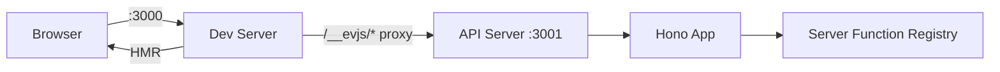

# Dev Server

## Command

```bash
ev dev
```

No flags needed — configuration comes from `ev.config.ts` or convention-based defaults.

## What It Does

`ev dev` starts **two servers** simultaneously:

| Server | Default Port | Purpose |
|--------|-------------|---------|
| **Dev Server** | `3000` | Client bundle with Hot Module Replacement (HMR) |
| **API Server** | `3001` | Server functions + route handlers, auto-started after first build |

The client dev server automatically proxies resolved framework server runtime
paths to the API server. By default those paths come from `server.basePath`,
including `/__evjs/fn`, `/__evjs/ppr`, and `/__evjs/rsc`; an explicit
`server.rsc.endpoint` is treated as a framework runtime path too.
SPA history fallback bypasses `/api` and those resolved framework runtime paths,
so mistyped API or framework runtime requests return proxy/server 404s instead
of `index.html`.



## Configuration

```ts
// ev.config.ts
import { defineConfig } from "@evjs/ev";

export default defineConfig({
  entry: "./src/main.tsx",         // Default
  html: "./index.html",            // Default
  dev: {
    port: 3000,                   // Client dev server port
    https: false,                 // HTTPS mode
  },
  server: {
    basePath: "/__evjs",          // Server functions/PPR/RSC paths derive from this
    dev: {
      port: 3001,                 // API port
      https: false,               // HTTPS for API server
    },
  },
});
```

`dev.port` and `server.dev.port` must be integer TCP ports from `1` to
`65535`. Custom `dev.proxy` rules must provide a non-empty `context` array of
pathname patterns and a `target` absolute HTTP(S) URL. Context patterns must
start with `/`, must not contain whitespace, a query string, or a hash, and
must not repeat within the same rule. Targets must not contain leading or
trailing whitespace. When the framework server is enabled, evjs keeps those
rules before the framework proxy for `/__evjs/*`.

## How It Works

1. `loadConfig(cwd)` loads `ev.config.ts`.
2. `resolveConfig()` applies defaults, then `plugin.setup()` collects lifecycle hooks.
3. `hooks.buildStart()` runs before compilation.
4. `BundlerAdapter.dev()` is invoked (applying plugin `bundlerConfig` hooks to the config).
5. Starts `dev server` for client HMR.
6. The adapter signals `onServerBundleReady` after discovery.
7. The CLI core auto-starts the API server via `@evjs/server/node`.
8. Sets up reverse proxy for the derived framework runtime paths, for example
   `/__evjs/fn`, `/__evjs/ppr`, and `/__evjs/rsc` → `localhost:3001`.

## API Server Runtime

In dev mode, evjs runs the built server bundle through a small Node bootstrap that calls `@evjs/server/node`. For production, deploy the emitted `{ fetch }` handler with the runtime wrapper that matches your host.

## Programmatic API

`ev dev` and `ev build` can also be used programmatically:

```ts
import { dev, build } from "@evjs/ev";
import { utoopackAdapter } from "@evjs/bundler-utoopack";

// Start dev server with an explicit bundler adapter
await dev({ dev: { port: 3000 } }, { cwd: "./my-app", bundler: utoopackAdapter });

// Run production build
await build({ entry: "./src/main.tsx" }, { cwd: "./my-app", bundler: utoopackAdapter });
```

The `bundler` option follows the same adapter contract as `ev.config.ts`: it
must be an object with a non-empty `name` and `build` / `dev` functions.

`@evjs/cli` also exports programmatic helpers that inject the default utoopack adapter, matching the `ev dev` and `ev build` commands.

`@evjs/bundler-utoopack` is the default dev adapter. It can refresh HTML-only
framework plan changes without restarting `ev dev`; adding or removing
configured entries still requires a restart until Utoopack exposes an entry
update API. `@evjs/bundler-webpack` can also run dev mode for architecture
validation and supports broader `updatePlan(update, graph)` changes in-process.

## Transport

The default HTTP transport works without app code. Call `initTransport()` at app
startup only when you need to customize the built-in HTTP adapter or replace it
with a custom adapter.

- In **dev mode**: the client dev server proxies derived framework server paths
  such as `/__evjs/fn`, `/__evjs/ppr`, and `/__evjs/rsc` → `:3001`
- In **production**: client and server are typically on the same origin
- The transport is **runtime-agnostic** — the client always posts to the same endpoint regardless of server runtime
- Use `credentials` and `headers` for the built-in HTTP adapter; fetch `mode` is not configurable
