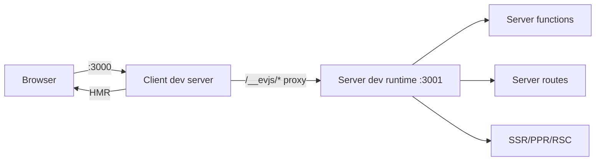

# Dev Server

## Command

```bash
ev dev
```

No flags needed. Configuration comes from `ev.config.ts` or convention-based
defaults.

## What It Starts

`ev dev` starts a browser-facing dev server and, when the app uses server
capabilities, a server dev runtime:

| Server | Default Port | Purpose |
| --- | --- | --- |
| **Client dev server** | `3000` | Browser bundle, HTML, and Hot Module Replacement (HMR). |
| **Server dev runtime** | `3001` | Server functions, server file routes, SSR, PPR, and RSC requests. |

The client dev server proxies server runtime paths to the server dev runtime.
By default those paths come from `server.basePath`, including `/__evjs/fn`,
`/__evjs/ppr`, and `/__evjs/rsc`.

SPA history fallback does not catch `/api` or the derived server runtime
paths. A mistyped server request therefore returns a server/proxy 404 instead of
the app HTML.



## Configuration

```ts
// ev.config.ts
import { defineConfig } from "@evjs/ev";

export default defineConfig({
  dev: {
    port: 3000,                   // Client dev server port
    https: false,                 // Client dev server HTTPS
  },
  server: {
    basePath: "/__evjs",          // Server runtime paths derive from this
    dev: {
      port: 3001,                 // Server dev runtime port
      https: false,               // Server dev runtime HTTPS
    },
  },
});
```

Conventional `src/pages` apps do not need an `entry` field. The dev server uses
the generated page app entry when page routes are discovered.

`dev.port` and `server.dev.port` must be integer TCP ports from `1` to
`65535`. Custom `dev.proxy` rules must provide a non-empty `context` array of
pathname patterns and a `target` absolute HTTP(S) URL. Context patterns must
start with `/`, must not contain whitespace, a query string, or a hash, and
must not repeat within the same rule. Targets must not contain leading or
trailing whitespace.

Custom proxy rules are applied before the built-in proxy for server runtime
paths, so app-specific API proxies can keep their own routing behavior.

## Request Flow

1. The client dev server serves browser code and HMR.
2. Server functions, server file routes, SSR, PPR, and RSC requests are routed
   to the server dev runtime.
3. Paths derived from `server.basePath` are proxied automatically.
4. Browser and server rebuilds happen as files change; restart `ev dev` after
   changing configured entries or route roots.

## Programmatic API

`ev dev` and `ev build` can also be used programmatically:

```ts
import { dev, build } from "@evjs/ev";
import { utoopackAdapter } from "@evjs/bundler-utoopack";

// Start dev server with an explicit bundler adapter
await dev({ dev: { port: 3000 } }, { cwd: "./my-app", bundler: utoopackAdapter });

// Run production build for conventional page routes
await build({ routing: { mode: "spa" } }, { cwd: "./my-app", bundler: utoopackAdapter });
```

The `bundler` option follows the same adapter contract as `ev.config.ts`: it
must be an object with a non-empty `name` and `build` / `dev` functions.

`@evjs/cli` also exports programmatic helpers that inject the default Utoopack
adapter, matching the `ev dev` and `ev build` commands.

## Transport

The default HTTP transport works without app code. Call `initTransport()` at app
startup only when you need to customize the built-in HTTP adapter or replace it
with a custom adapter.

- In **dev mode**, the client dev server proxies server runtime paths such as
  `/__evjs/fn`, `/__evjs/ppr`, and `/__evjs/rsc` to the server dev runtime.
- In **production**, client and server are typically on the same origin.
- Use `transport.baseUrl` when browser-initiated server function requests should
  target a different origin.
- Use `credentials` and `headers` for the built-in HTTP adapter; fetch `mode` is
  not configurable.
