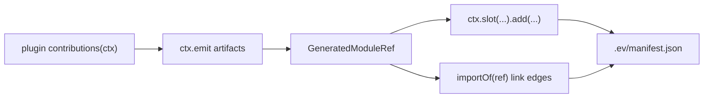

# Generated Contributions IR

`.ev` is the agent-readable framework IR for evjs builds. It records what file
conventions discovered, what framework entries were generated, what plugins
added, and how those generated pieces are attached to framework slots.

## Concept

A contribution is a declarative unit in the framework IR. It can produce
generated artifacts, link those artifacts together, and attach them to
framework slots.

That definition is intentionally narrower than an arbitrary temporary file
system. Plugins do not write random files into `.ev`; they declare artifacts and
relationships. evjs then materializes the final `.ev` tree and manifest.



## Directory Shape

```txt
.ev/
├── framework/
│   ├── app-graph.json
│   └── build-plan.json
├── entries/
│   ├── main.ts
│   └── server.ts
├── plugins/
│   └── qiankun/
│       └── slave/
│           ├── entry-wrapper.ts
│           └── original-entry.ts
├── manifest.json
└── types.d.ts
```

The structure is stable and readable:

- `framework/` contains convention discovery and build-plan snapshots.
- `entries/` contains framework-owned entry facades consumed by bundlers.
- `plugins/<plugin>/` contains plugin generated artifacts.
- Plugin names are normalized into path segments; a role suffix such as
  `@evjs/plugin-qiankun:slave` becomes `qiankun/slave`.
- `manifest.json` ties together generated artifacts, import edges, slot items,
  producer plugin names, scopes, and final entries.

Generated files may import generated-only `@evjs/ev/_internal/*` helpers when
they need framework runtime internals. Plugin source should not import those
subpaths; plugin authoring uses `@evjs/ev/plugin`. The `ctx.framework` object
is immutable so plugins can inspect the IR but cannot mutate framework state.

## Authoring API

Use `ctx.emit.module()` for generated code, `ctx.emit.data()` for generated JSON
data, and `ctx.emit.entryFacade()` when a wrapper plugin needs to preserve a
framework-generated entry that it is about to replace.

Use `ctx.emit.importOf(ref)` or `helpers.importOf(ref)` to link generated
artifacts together. The returned specifier is valid only inside generated
source. Application source should not import `.ev` paths or
`evjs:generated/*` specifiers.

Use `ctx.slot(name).add(...)` to attach generated artifacts to the framework.
The supported v1 slots are:

| Slot | Covers |
|------|--------|
| `client.entry` | Entry imports and entry wrapper modules, including replacement wrappers |
| `client.runtime.plugin` | Runtime plugin modules and export keys |
| `server.request.middleware` | Framework request middleware in the server pipeline |
| `html.tag` | Structured `meta`, `link`, `script`, and `style` tags |
| `resolve.alias` | Semantic module aliasing to user modules, packages, absolute paths, or generated artifacts |
| `resolve.external` | Externalized module resolution, usually paired with `html.tag` CDN resources |

## Boundaries

Generated contributions are the source of truth for file-convention entry
composition and plugin entry/runtime/html/resolution injection. Old virtual
entry loaders should not be reintroduced for those jobs.

The contribution layer does not replace plugin lifecycles:

- Use `config()` for framework config defaults or validation-sensitive config.
- Use `setup()` to allocate plugin state and return lifecycle hooks.
- Use `bundlerConfig()` for low-level bundler features not modeled as slots.
- Use `transformHtml()` for AST-level HTML rewrites.
- Use `buildOutput()` and `buildEnd()` for deployment metadata and final files.

This split keeps the IR readable without pretending every plugin capability is
an entry contribution.

## Agent Workflow

For code review or debugging, inspect `.ev/manifest.json` first:

1. Find the final entry under `entries`.
2. Inspect `generated.modules` for plugin artifacts and producer plugin names.
3. Inspect `generated.slots` to see where artifacts attach.
4. Inspect `generated.importEdges` to understand generated-to-generated imports.
5. Open the matching files under `.ev/entries` and `.ev/plugins`.

This gives agents and humans a complete view of framework-generated code that
would otherwise be hidden behind loaders or arbitrary temporary files.
