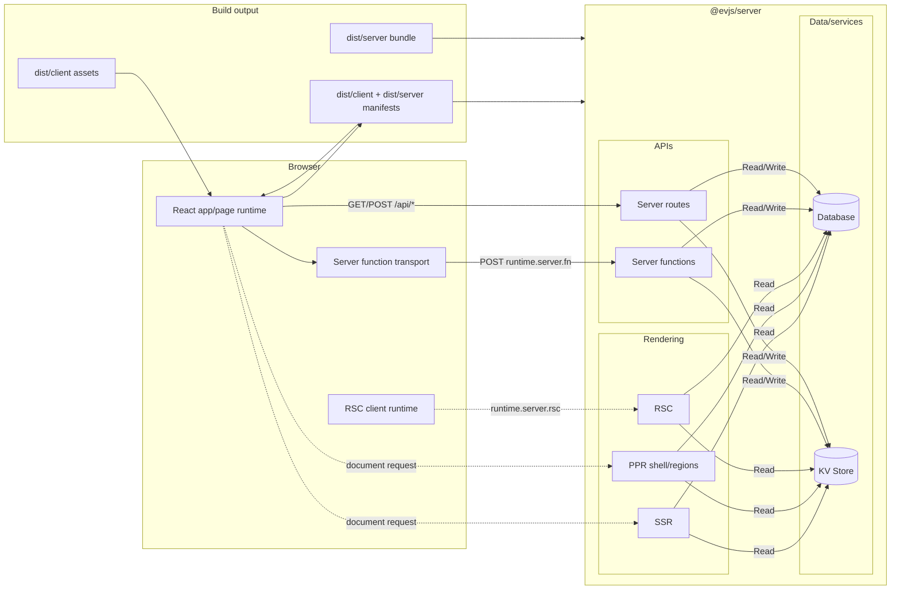

# What is evjs?

> **ev** = **Ev**aluation · **Ev**olution — evaluate across runtimes, evolve with AI tooling.

evjs is a zero-config React fullstack framework with page-based client routes,
server functions, route handlers, SSR, PPR, RSC integration points, and deployment-oriented output.

The framework keeps a clear split between:

- **application code**: React pages, server functions, and server routes;
- **framework semantics**: `AppGraph`, `BuildPlan`, and `BuildOutput`;
- **bundlers**: Utoopack by default, webpack as the validation adapter for newer framework capabilities;
- **runtime/server/deploy adapters**: consume the framework manifest instead of reading bundler stats.

SPA page routes keep navigation, loader, search, and params semantics inside
the framework. MPA page routes use the page runtime without adding a router.

## Features

- **Zero-config page routes** — `ev dev` / `ev build` discover `src/pages` unless the project declares explicit `app` or `pages` config.
- **SPA and MPA modes** — `routing.mode: "spa"` builds one framework-owned app; `"mpa"` builds independent router-free pages.
- **Framework pages** — page modules can declare CSR/SSR/SSG/PPR/RSC rendering metadata next to the component.
- **Server functions** — `"use server"` modules become browser-callable RPC stubs.
- **Server routes** — standard Web `Request`/`Response` route handlers discovered from `src/apis`.
- **Unified server boundary** — `@evjs/server` handles server functions, server routes, SSR, PPR, and RSC requests.
- **Plugin system** — config, bundler, output, HTML, and build lifecycle hooks.
- **Deployment output** — one public-safe framework manifest plus adapter-generated platform artifacts.

## Full-Stack Architecture

## Current Architecture In One Sentence

evjs discovers page routes and explicit server/page metadata into an `AppGraph`,
derives a bundler-independent `BuildPlan`, links bundler facts into a single
`BuildOutput`, and lets runtime, server, and deployment adapters consume
that output while plugins extend the supported lifecycle stages.
