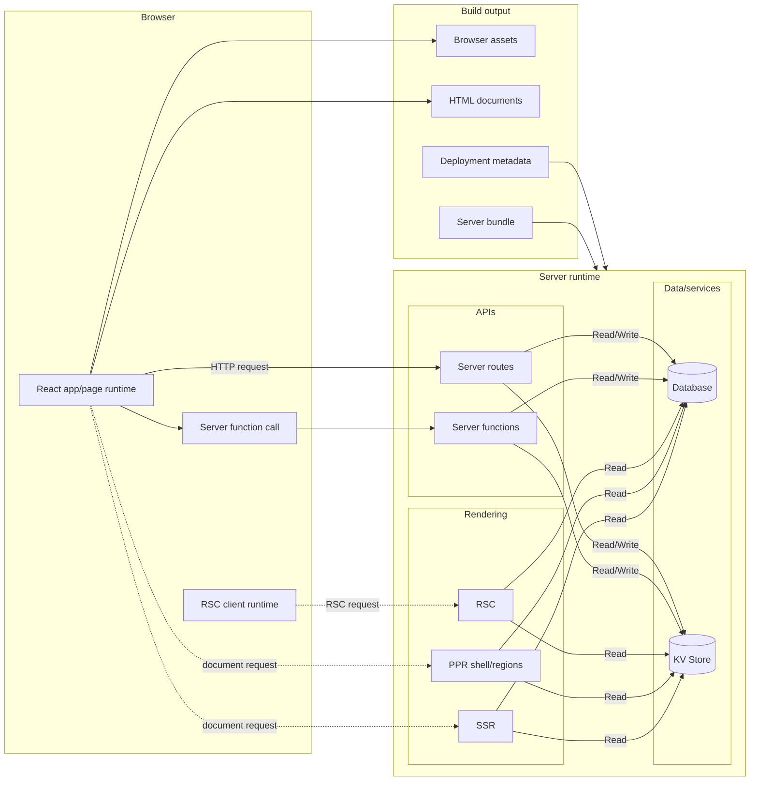

# What is evjs?

> **ev** = **Ev**aluation · **Ev**olution — evaluate across runtimes, evolve with AI tooling.

evjs is a zero-config React fullstack framework with page-based client routes,
server functions, route handlers, SSR, PPR, RSC integration points, and
deployment-oriented output.

The framework keeps a clear split between:

- **application code**: React pages, server functions, and server routes;
- **file conventions**: `src/pages`, `src/apis`, middleware, and server-only modules;
- **framework IR**: generated `.ev` entries, plugin artifacts, slots, and manifest data;
- **bundlers**: Utoopack by default, with webpack available as a validation adapter;
- **deployment output**: browser assets, optional server bundles, and deployment metadata.

SPA page routes keep navigation, loader, search, and params semantics inside
the framework. MPA page routes use the page runtime without adding a router.

## Features

- **Zero-config page routes** — `ev dev` / `ev build` discover `src/pages` unless the project declares explicit `app` or `pages` config.
- **SPA and MPA modes** — `routing.mode: "spa"` builds one app; `"mpa"` builds independent router-free pages.
- **Render modes** — page modules can declare CSR, SSR, SSG, PPR, or RSC behavior next to the component.
- **Server functions** — `"use server"` modules become browser-callable functions.
- **Server routes** — standard Web `Request`/`Response` route handlers are discovered from `src/apis`.
- **Unified server runtime** — server functions, server routes, SSR, PPR, and RSC share the same server boundary.
- **Agent-readable framework IR** — `.ev` records generated entries, plugin modules, slot attachments, import edges, and manifest data before bundling.
- **Plugin system** — generated contributions for framework IR plus config, bundler, HTML, build output, and build lifecycle hooks.
- **Deployment output** — static assets plus optional Node, static-host, or edge deployment artifacts.

## Full-Stack Architecture

## How It Fits Together

evjs discovers page routes from `src/pages`, server file routes from `src/apis`,
and server functions from reachable `"use server"` modules. It then materializes
`.ev` as the framework IR: generated entry facades, plugin generated modules,
structured slot attachments, and a manifest that agents and tools can inspect
before any bundler-specific work.

`ev build` consumes that IR to emit browser files and, when the app uses server
capabilities, a server bundle that deployment adapters can run on Node, static
hosts, edge workers, or a split CDN/origin setup.
