# Plugins

evjs plugins extend stable framework stages and, when needed, mutate the selected bundler config. App graph and build plan creation are internal framework steps; plugins work with config, bundler config, `BuildOutput`, HTML documents, and build results.

## Quick Example

```ts
import { defineConfig } from "@evjs/ev";

export default defineConfig({
  plugins: [
    {
      name: "build-timer",
      setup() {
        const start = Date.now();
        return {
          buildEnd({ output }) {
            console.log(`Build ${output.buildId} finished in ${Date.now() - start}ms`);
            console.log(Object.keys(output.assets).length, "entry asset groups");
          },
        };
      },
    },
  ],
});
```

## Plugin Shape

```ts
import type {
  Config,
  DefaultBundlerConfig,
  Plugin,
  PluginHooks,
  ResolvedConfig,
} from "@evjs/ev";

interface Plugin<TBundlerConfig = DefaultBundlerConfig> {
  name: string;
  dependencies?: string[];
  optionalDependencies?: string[];
  enforce?: "pre" | "normal" | "post";

  config?(config: Config<TBundlerConfig>, ctx: PluginConfigContext):
    | Config<TBundlerConfig>
    | undefined
    | Promise<Config<TBundlerConfig> | undefined>;

  setup?(ctx: PluginContext<TBundlerConfig>):
    | PluginHooks<TBundlerConfig>
    | undefined
    | Promise<PluginHooks<TBundlerConfig> | undefined>;
}
```

Plugin names must be unique. `config` and `setup` must be functions when
provided. `dependencies` and `optionalDependencies` control ordering and are
applied to both `config()` and `setup()` hooks. Dependency lists must contain
unique, non-empty plugin names; the same plugin name cannot appear in both
`dependencies` and `optionalDependencies`. Extra plugin object metadata is
ignored by evjs so plugins can keep package-local metadata fields.

## Config Hook

Use `config()` for framework configuration that must be visible before defaults, graph analysis, dev proxy setup, or runtime path derivation.
Return a config object, or return `undefined` after mutating the received
object in place. `null`, arrays, and other return values are rejected. The
resulting config is validated by the same resolver as user config before
`setup()` hooks or bundling run.

```ts
import { defineConfig, merge } from "@evjs/ev";

export default defineConfig({
  plugins: [
    {
      name: "server-base-path",
      config(config) {
        merge(config, {
          server: {
            basePath: "/_framework",
          },
        });
        return config;
      },
    },
  ],
});
```

Do not use `bundlerConfig()` for framework protocol paths. Server functions,
PPR, and RSC endpoints are derived from `server.basePath`.

## Setup Context

```ts
interface PluginContext<TBundlerConfig = DefaultBundlerConfig> {
  mode: "development" | "production";
  command: "dev" | "build";
  cwd: string;
  config: ResolvedConfig<TBundlerConfig>;
  logger: Logger;
  addWatchFile(file: string): void;
}
```

Use `setup()` to allocate shared state and return lifecycle hooks. Return a
hooks object or `undefined`; `null`, arrays, and non-function hook fields are
rejected before lifecycle hooks run. Unknown hook keys are ignored when plugins
attach package-local metadata to the returned object.

## Lifecycle

```mermaid
flowchart LR
  A["config hooks"] --> B["resolve config"]
  B --> C["setup hooks"]
  C --> E["buildStart"]
  E --> F["create AppGraph"]
  F --> H["create BuildPlan"]
  H --> J["bundlerConfig hooks"]
  J --> K["bundler build"]
  K --> L["link BuildOutput"]
  L --> M["buildOutput hooks"]
  M --> N["transformHtml per document"]
  N --> O["buildEnd"]
  O --> P["dispose"]
```



| Hook | Purpose |
|------|---------|
| `buildStart(ctx)` | Build setup before framework analysis |
| `bundlerConfig(config, ctx)` | Mutate selected bundler config |
| `buildOutput(output, ctx)` | Add deployment/runtime metadata to the single framework output |
| `transformHtml(doc, ctx)` | Mutate one HTML document at a time; receives the current manifest result fields |
| `buildEnd({ output, isRebuild })` | Emit final artifacts after build |
| `dispose(ctx)` | Cleanup |

## HTML Transform Context

`transformHtml()` receives one parsed document per output HTML file. Branch on `ctx.kind` instead of guessing from filenames.

```ts
transformHtml(doc, ctx) {
  doc.head?.appendChild(doc.createComment(` build ${ctx.buildId} `));

  if (ctx.kind === "app") {
    doc.documentElement?.setAttribute("data-app", ctx.appId);
  }

  if (ctx.kind === "page") {
    doc.documentElement?.setAttribute("data-page", ctx.pageId);
  }
}
```

Context fields include:

- `ctx.kind`: `"app"` or `"page"`;
- `ctx.appId` or `ctx.pageId`;
- `ctx.fileName` and `ctx.template`;
- `ctx.assets`;
- `ctx.output`: the full `BuildOutput`;
- `ctx.buildId` and `ctx.publicPath`.

The document type is `HtmlDocument`, a bundler-agnostic subset of standard DOM APIs:

```ts
import type { HtmlDocument } from "@evjs/ev";
```

## Build Result

`buildEnd()` receives a build result with the linked framework output and
narrower manifest views:

```ts
setup() {
  return {
    buildEnd({ output, clientManifest, serverManifest, isRebuild }) {
      console.log("Apps:", Object.keys(output.apps));
      console.log("Pages:", Object.keys(output.pages));
      console.log("Functions:", Object.keys(output.server.functions));
      console.log("Client JS:", clientManifest.assets.js);
      console.log("Server entry:", serverManifest.entry);
      console.log("Rebuild:", isRebuild);
    },
  };
}
```

Deployment plugins should read routes, functions, assets, and runtime
paths from `output`. Plugins that only need client or server bundle summaries can
use `clientManifest` and `serverManifest`. HTML hooks receive the same result
fields plus document-specific fields such as `ctx.kind`, `ctx.fileName`, and
`ctx.assets`.

## Bundler Config

`Plugin` defaults to the Utoopack config type, matching the default bundler.
Use adapter helpers for type-safe low-level changes.

For Utoopack:

```ts
import { merge, utoopack } from "@evjs/bundler-utoopack";

export function yamlPlugin() {
  return {
    name: "yaml-support",
    setup() {
      return {
        bundlerConfig: utoopack((cfg) => {
          merge(cfg, {
            module: {
              rules: {
                ".yaml": { type: "json" },
              },
            },
          });
        }),
      };
    },
  };
}
```

For webpack projects, switch the config generic and use the webpack adapter
helper:

```ts
import { defineConfig } from "@evjs/ev";
import { webpack, webpackAdapter, type WebpackConfig } from "@evjs/bundler-webpack";

export default defineConfig<WebpackConfig>({
  bundler: webpackAdapter,
  plugins: [
    {
      name: "webpack-alias",
      setup() {
        return {
          bundlerConfig: webpack((configs) => {
            for (const cfg of configs) {
              cfg.resolve ??= {};
              cfg.resolve.alias ??= {};
              cfg.resolve.alias["@app"] = "./src";
            }
          }),
        };
      },
    },
  ],
});
```

## Recipes

### Deployment Metadata

```ts
export function deployMetadata() {
  return {
    name: "deploy-metadata",
    setup() {
      return {
        buildOutput(output) {
          output.deployment = {
            platform: "custom",
            builtAt: new Date().toISOString(),
          };
        },
      };
    },
  };
}
```

### Per-Page Metadata

```ts
export function pageMetadata() {
  return {
    name: "page-metadata",
    setup() {
      return {
        transformHtml(doc, ctx) {
          if (ctx.kind !== "page") return;
          const meta = doc.createElement("meta");
          meta.setAttribute("name", "evjs-page");
          meta.setAttribute("content", ctx.pageId);
          doc.head?.appendChild(meta);
        },
      };
    },
  };
}
```

### CSP Nonce

```ts
import crypto from "node:crypto";

export function cspNonce() {
  return {
    name: "csp-nonce",
    setup() {
      return {
        transformHtml(doc) {
          const nonce = crypto.randomBytes(16).toString("base64");
          for (const script of doc.querySelectorAll("script")) {
            script.setAttribute("nonce", nonce);
          }
        },
      };
    },
  };
}
```
