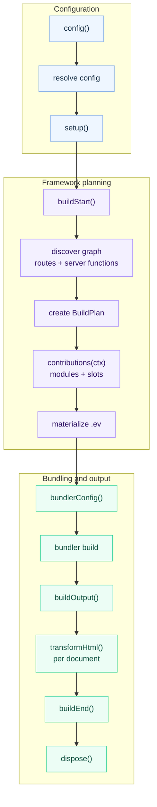

# Plugins

evjs plugins extend supported framework stages and, when needed, mutate the
selected bundler config. Most plugins work with config, bundler config, HTML
documents, and final build results.

## Quick Example

```ts
import { defineConfig } from "@evjs/ev";

export default defineConfig({
  plugins: [
    {
      name: "build-timer",
      setup() {
        const start = Date.now();
        return {
          buildEnd({ output }) {
            console.log(`Build ${output.buildId} finished in ${Date.now() - start}ms`);
            console.log(Object.keys(output.assets).length, "entry asset groups");
          },
        };
      },
    },
  ],
});
```

## Plugin Shape

```ts
import type { Config, DefaultBundlerConfig, ResolvedConfig } from "@evjs/ev/config";
import type { ContributionContext, Plugin, PluginConfigContext, PluginContext, PluginHooks } from "@evjs/ev/plugin";

interface Plugin<TBundlerConfig = DefaultBundlerConfig> {
  name: string;
  dependencies?: string[];
  optionalDependencies?: string[];
  enforce?: "pre" | "normal" | "post";

  config?(config: Config<TBundlerConfig>, ctx: PluginConfigContext):
    | Config<TBundlerConfig>
    | undefined
    | Promise<Config<TBundlerConfig> | undefined>;

  setup?(ctx: PluginContext<TBundlerConfig>):
    | PluginHooks<TBundlerConfig>
    | undefined
    | Promise<PluginHooks<TBundlerConfig> | undefined>;

  contributions?(ctx: ContributionContext<TBundlerConfig>):
    | void
    | Promise<void>;
}
```

Plugin names must be unique. `config` and `setup` must be functions when
provided. `dependencies` and `optionalDependencies` control ordering and are
applied to both `config()` and `setup()` hooks. Dependency lists must contain
unique, non-empty plugin names; the same plugin name cannot appear in both
`dependencies` and `optionalDependencies`. Extra plugin object metadata is
ignored by evjs so plugins can keep package-local metadata fields.

## Config Hook

Use `config()` for framework configuration that must be visible before defaults,
route discovery, dev proxy setup, or runtime path derivation.
Return a config object, or return `undefined` after mutating the received
object in place. `null`, arrays, and other return values are rejected. The
resulting config is validated by the same resolver as user config before
`setup()` hooks or bundling run.

```ts
import { defineConfig } from "@evjs/ev";
import { merge } from "@evjs/ev/config";

export default defineConfig({
  plugins: [
    {
      name: "server-base-path",
      config(config) {
        merge(config, {
          server: {
            basePath: "/_framework",
          },
        });
        return config;
      },
    },
  ],
});
```

Do not use `bundlerConfig()` for framework protocol paths. Server functions,
PPR, and RSC endpoints are derived from `server.basePath`.

## Setup Context

```ts
interface PluginContext<TBundlerConfig = DefaultBundlerConfig> {
  mode: "development" | "production";
  command: "dev" | "build";
  cwd: string;
  config: ResolvedConfig<TBundlerConfig>;
  logger: Logger;
  addWatchFile(file: string): void;
}
```

Use `setup()` to allocate shared state and return lifecycle hooks. Return a
hooks object or `undefined`; `null`, arrays, and non-function hook fields are
rejected before lifecycle hooks run. Unknown hook keys are ignored when plugins
attach package-local metadata to the returned object.

## Lifecycle



| Hook | Purpose |
|------|---------|
| `buildStart(ctx)` | Build setup before route discovery and bundling |
| `bundlerConfig(config, ctx)` | Mutate selected bundler config |
| `buildOutput(output, ctx)` | Add deployment/runtime metadata to the build output |
| `transformHtml(doc, ctx)` | Mutate one HTML document at a time; receives the current manifest result fields |
| `buildEnd({ output, isRebuild })` | Emit final artifacts after build |
| `dispose(ctx)` | Cleanup |

## Generated Contributions

A contribution is a declarative unit in the framework IR. It can produce
generated artifacts, link those artifacts together, and attach them to
framework slots.

Use `contributions()` when a plugin needs to extend the generated `.ev` IR.
This is the right layer for entry imports, runtime plugin modules, constrained
SPA route additions, HTML tags, framework request middleware, and semantic
resolution changes. Keep loaders for real bundler transforms such as compiling a
custom file type.

`.ev` is generated output. It contains:

- `.ev/framework/app-graph.json`: discovered file-convention graph;
- `.ev/framework/build-plan.json`: final bundler-independent build plan;
- `.ev/entries/*`: framework entry facades consumed by bundlers;
- `.ev/plugins/<plugin>/*`: plugin generated modules and entry facades;
- `.ev/manifest.json`: graph, generated artifacts, slots, import edges, and final entries.

The contribution model has four parts:

| Concept | Meaning |
|---------|---------|
| Generated artifact | A module, data file, or framework entry facade emitted through `ctx.emit`. |
| Opaque ref | A `GeneratedModuleRef` returned by `ctx.emit`; plugins do not receive `.ev` file paths. |
| Link edge | A generated-to-generated import declared through `ctx.emit.importOf(ref)` or `helpers.importOf(ref)`. |
| Slot item | A structured attachment declared through `ctx.slot(name).add(...)`. |

`ctx.framework` is an immutable, read-only public view of the framework IR. It
exposes entries, apps, pages, routes, server routes, and server functions
without exposing the internal `BuildPlan` or `AppGraph` objects. Plugin code
should import authoring types from `@evjs/ev/plugin`; `@evjs/ev/_internal/*` is
for CLI tooling, bundler adapters, and framework-generated code.

Generated modules use opaque refs instead of exposing filesystem paths:

```ts
import type { Plugin } from "@evjs/ev/plugin";

export function analyticsPlugin(): Plugin {
  return {
    name: "analytics",
    contributions(ctx) {
      const runtime = ctx.emit.module({
        id: "runtime",
        scope: { kind: "app" },
        source: "export function install() { console.log('analytics'); }",
      });

      const entry = ctx.emit.module({
        id: "entry",
        scope: { kind: "app" },
        source: ({ importOf }) =>
          `import { install } from ${JSON.stringify(importOf(runtime))};\ninstall();`,
      });

      ctx.slot("client.entry").add({
        id: "entry",
        module: entry,
        position: "after-main",
      });
    },
  };
}
```

When a plugin replaces an entry but still needs the original framework facade,
use `ctx.emit.entryFacade()` instead of reconstructing framework internals:

```ts
contributions(ctx) {
  const entry = ctx.framework.getPagesAppEntry();
  if (!entry) return;

  const original = ctx.emit.entryFacade({
    id: "original-entry",
    entry,
  });

  const wrapper = ctx.emit.module({
    id: "entry-wrapper",
    scope: { kind: "app" },
    source: ({ importOf }) =>
      `export const load = () => import(${JSON.stringify(importOf(original))});`,
  });

  ctx.slot("client.entry").add({
    id: "entry-wrapper-slot",
    module: wrapper,
    position: "before-main",
    mode: "replace",
  });
}
```

Generated plugin paths are stable and readable. For example, a plugin named
`@evjs/plugin-qiankun:slave` writes modules under
`.ev/plugins/qiankun/slave/*` and exposes specifiers like
`evjs:generated/qiankun/slave/entry-wrapper`.

Available slots:

| Slot | Purpose |
|------|---------|
| `client.entry` | Add generated modules around the client entry at `polyfill`, `before-main-imports`, `after-main-imports`, `before-main`, or `after-main` |
| `client.runtime.plugin` | Register runtime plugin modules and optional export keys |
| `client.route` | Append generated SPA routes or replace modules for existing SPA route ids |
| `server.request.middleware` | Add framework request middleware to the server pipeline |
| `html.tag` | Add structured `meta`, `link`, `script`, or `style` tags |
| `resolve.alias` | Redirect a module specifier to a user module, package, absolute path, or generated module |
| `resolve.external` | Mark a specifier as provided by an external runtime; inject CDN tags separately through `html.tag` |

Use `client.route` when a platform plugin needs route IR that agents and
inspection tools can see. Append mode requires a `path` and creates a route with
the declared `routeId`; replace mode requires an existing generated route id and
preserves the current route path unless a new path is declared. Runtime plugins
can still export `patchRoutes`, `patchClientRoutes`, `modifyRouterOptions`,
`wrapRoot`, `rootContainer`, or `render` when the route or render behavior must
be decided in the browser.

`resolve.external` accepts `runtime: "client" | "server" | "all"`. The
Webpack adapter applies that filter per target. The current Utoopack adapter
only exposes a top-level externals config, so client/all externals are mapped
there and server-only externals fail fast when client entries are present.

`contributions()` is separate from lifecycle hooks. Existing `config()`,
`setup()`, `bundlerConfig()`, `transformHtml()`, and `buildEnd()` hooks remain
the extension points for configuration, low-level bundler changes, AST-level
HTML rewrites, and deployment output.

## HTML Transform Context

`transformHtml()` receives one parsed document per output HTML file. Branch on `ctx.kind` instead of guessing from filenames.

```ts
transformHtml(doc, ctx) {
  doc.head?.appendChild(doc.createComment(` build ${ctx.buildId} `));

  if (ctx.kind === "app") {
    doc.documentElement?.setAttribute("data-app", ctx.appId);
  }

  if (ctx.kind === "page") {
    doc.documentElement?.setAttribute("data-page", ctx.pageId);
  }
}
```

Context fields include:

- `ctx.kind`: `"app"` or `"page"`;
- `ctx.appId` or `ctx.pageId`;
- `ctx.fileName` and `ctx.template`;
- `ctx.assets`;
- `ctx.output`: the current build output;
- `ctx.buildId` and `ctx.publicPath`.

The document type is `HtmlDocument`, a bundler-agnostic subset of standard DOM APIs:

```ts
import type { HtmlDocument } from "@evjs/ev/plugin";
```

## Build Result

`buildEnd()` receives the final build output plus narrower client/server
manifest and deployment metadata views:

```ts
setup() {
  return {
    buildEnd({
      output,
      clientManifest,
      serverManifest,
      deploymentMetadata,
      isRebuild,
    }) {
      console.log("Apps:", Object.keys(output.apps));
      console.log("Pages:", Object.keys(output.pages));
      console.log("Client asset groups:", Object.keys(clientManifest.assets ?? {}));
      console.log("Server entry:", serverManifest.entry);
      console.log("Server routes:", serverManifest.routes.length);
      console.log("Deploy routes:", deploymentMetadata.routes.length);
      console.log("Rebuild:", isRebuild);
    },
  };
}
```

Deployment plugins should prefer `deploymentMetadata` for routes, documents,
assets, and the server entry. Plugins that need the complete internal build graph
can still inspect `output` in memory. Plugins that only need the client bundle
summary can use `clientManifest`: check `clientManifest.routing.kind` before
reading SPA `routes` or MPA `pages`. Plugins that only need the server entry and
server-handled route summary can use `serverManifest.routes`; full deployment
planning should still use `deploymentMetadata.routes`. HTML hooks receive the
same result fields plus document-specific fields such as `ctx.kind`,
`ctx.fileName`, and `ctx.assets`.

## Bundler Config

`Plugin` defaults to the Utoopack config type, matching the default bundler.
Use adapter helpers for type-safe low-level changes.

For Utoopack:

```ts
import { merge, utoopack } from "@evjs/bundler-utoopack";

export function yamlPlugin() {
  return {
    name: "yaml-support",
    setup() {
      return {
        bundlerConfig: utoopack((cfg) => {
          merge(cfg, {
            module: {
              rules: {
                ".yaml": { type: "json" },
              },
            },
          });
        }),
      };
    },
  };
}
```

For webpack projects, switch the config generic and use the webpack adapter
helper:

```ts
import { defineConfig } from "@evjs/ev";
import { webpack, webpackAdapter, type WebpackConfig } from "@evjs/bundler-webpack";

export default defineConfig<WebpackConfig>({
  bundler: webpackAdapter,
  plugins: [
    {
      name: "webpack-alias",
      setup() {
        return {
          bundlerConfig: webpack((configs) => {
            for (const cfg of configs) {
              cfg.resolve ??= {};
              cfg.resolve.alias ??= {};
              cfg.resolve.alias["@app"] = "./src";
            }
          }),
        };
      },
    },
  ],
});
```

## Recipes

### Deployment Metadata

```ts
export function deployMetadata() {
  return {
    name: "deploy-metadata",
    setup() {
      return {
        buildOutput(output) {
          output.deployment = {
            platform: "custom",
            builtAt: new Date().toISOString(),
          };
        },
      };
    },
  };
}
```

### Per-Page Metadata

```ts
export function pageMetadata() {
  return {
    name: "page-metadata",
    setup() {
      return {
        transformHtml(doc, ctx) {
          if (ctx.kind !== "page") return;
          const meta = doc.createElement("meta");
          meta.setAttribute("name", "evjs-page");
          meta.setAttribute("content", ctx.pageId);
          doc.head?.appendChild(meta);
        },
      };
    },
  };
}
```

### CSP Nonce

```ts
import crypto from "node:crypto";

export function cspNonce() {
  return {
    name: "csp-nonce",
    setup() {
      return {
        transformHtml(doc) {
          const nonce = crypto.randomBytes(16).toString("base64");
          for (const script of doc.querySelectorAll("script")) {
            script.setAttribute("nonce", nonce);
          }
        },
      };
    },
  };
}
```
