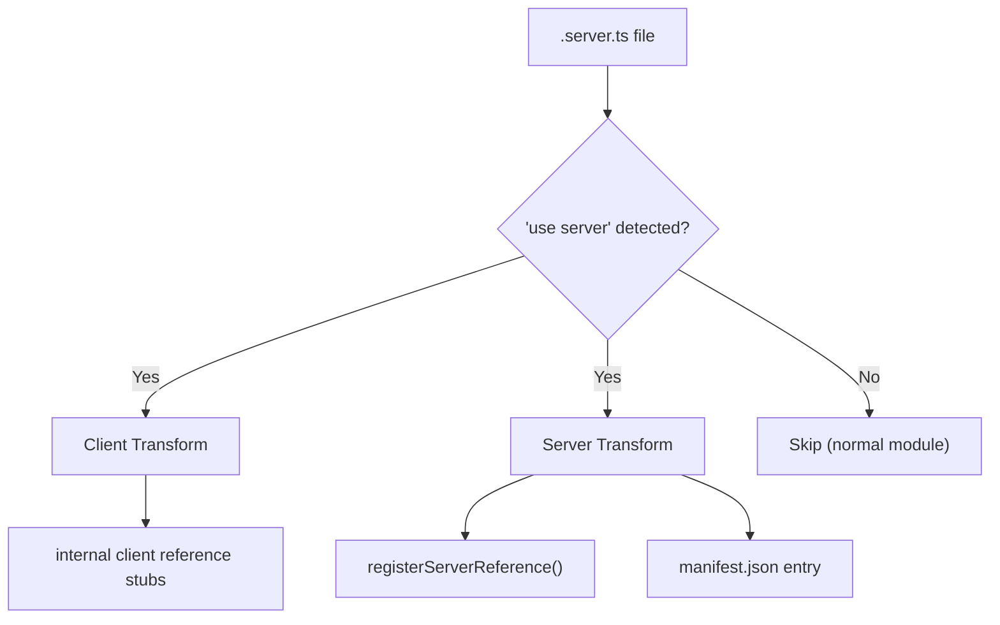

# Server Functions

Server functions let you write backend logic alongside your frontend code and
call it from React components with local-call ergonomics over a typed server
boundary. The call shape looks like a normal async function, but the framework
still serializes arguments, dispatches the request through the framework server,
and returns a serialized result or structured error. While not strictly
required, we recommend suffixing server function files with `.server.ts`. The
build system transforms them into RPC calls automatically.

## Basic Usage

```ts
// src/api/users.server.ts
"use server";

export async function getUsers() {
  return await db.users.findMany();
}

export async function createUser(name: string, email: string) {
  return await db.users.create({ data: { name, email } });
}

export const deleteUser = async (id: string) => {
  return await db.users.delete({ where: { id } });
};
```

### Rules

- File must start with `"use server";` directive
- Malformed `"use server"` modules fail with
  `Server function module could not be parsed:` plus the parser message.
  Graph analysis includes the file path before server-function transforms run.
- Only **named callable exports** are transformed: `export function`,
  `export async function`, `export const name = () => {}`,
  `export const name = async () => {}`, or same-module aliases such as
  `export { saveUser as updateUser }`
- A `"use server"` module must export at least one named server function. If a
  module only exports types or local helpers, remove the directive or export the
  callable function.
- Server functions can return a value or a Promise. The runtime awaits the
  result either way. Generator and async-generator functions are not supported
  because they return iterators, not a single transport result.
- Return values and structured `ServerError.data` must be JSON-serializable.
  Returning `undefined` is allowed and resolves as `undefined` in client code;
  on the raw HTTP response it serializes as an empty success payload.
- Calls are always async server-boundary calls. Do not rely on closure identity,
  synchronous side effects, class instances, DOM objects, streams, or other
  non-serializable references crossing the boundary.
- Export aliases can use identifier or string-literal names, but the local
  binding must be a function declaration or `const` initialized to a function.
  String-literal aliases must not be empty or padded with whitespace. Prefer
  identifier names for ordinary TypeScript imports.
- Type-only exports such as `export type { UserInput }` are ignored by the
  runtime transform and can live beside server functions.
- Ambient `declare` exports are not server functions because they emit no
  runtime implementation. Use a real function body for every exported server
  function.
- **Recommendation**: Use the `.server.ts` extension (e.g. `users.server.ts`) or place them in a `src/api/` directory to help differentiate them from client code.
- No default exports, runtime re-exports from other modules, or exported
  non-function runtime values such as constants
- Server functions require the framework server. If `server: false`, any
  reachable `"use server"` module is a build error. "Reachable" means imported
  by the app, page, or server entry import graph; unrelated files outside the
  graph are ignored.

## Request Context Helpers

Server functions run inside the framework request lifecycle, so they can use the
request helpers exported by `@evjs/server`:

```ts
// src/api/session.server.ts
"use server";

import { getCookie, headers, request, waitUntil } from "@evjs/server";

export async function currentSession() {
  const req = request();
  const locale = headers().get("accept-language");
  const session = getCookie("session");

  waitUntil(auditSessionAccess(req.url));

  return { locale, hasSession: Boolean(session) };
}
```

These helpers only work while evjs is handling a server function, route handler,
middleware, SSR render, RSC Flight request, or PPR region request. Calling them
at module scope, during build, or from client code throws this diagnostic:

```text
[evjs] Server context helpers (request(), headers(), cookie helpers, waitUntil()) must be called during a request lifecycle. Call them inside a server function, route handler, middleware, or framework render.
```

## Query Patterns

evjs provides type-safe `useQuery` and `useSuspenseQuery` that accept server functions directly. Server function stubs also carry `.queryKey()`, `.fnId`, `.fnName`, and fixed-signature `.fnArity` metadata for cache invalidation and introspection.

### Direct Usage (Recommended)

```tsx
import {
  useQuery,
  useSuspenseQuery,
  useMutation,
  useQueryClient,
  getFnQueryKey,
  getFnQueryOptions,
} from "@evjs/client";
import { getUsers, getUser, createUser } from "../api/users.server";

// Queries — pass server functions directly, types are inferred
const { data: users } = useQuery(getUsers);               // data: User[]
const { data: user } = useQuery(getUser, userId);          // data: User
const { data } = useSuspenseQuery(getUsers);               // data: User[] (guaranteed)

// Mutations — pass server functions directly, just like useQuery
const queryClient = useQueryClient();
const { mutate } = useMutation(createUser, {
  onSuccess: () => {
    queryClient.invalidateQueries({ queryKey: getFnQueryKey(getUsers) });
  },
});

// Route loaders / prefetching — use getFnQueryOptions()
loader: ({ context }) =>
  context.queryClient.ensureQueryData(getFnQueryOptions(getUsers));
```

The function overloads require compiler-generated server function stubs because
the server boundary needs a stable function id, a request endpoint, and query
key metadata. Passing a plain async function to `useQuery(fn)`,
`useSuspenseQuery(fn)`, `useMutation(fn)`, `getFnQueryKey(fn)`, or
`getFnQueryOptions(fn)` throws an `[evjs]` diagnostic that names the rejected
function. Use the TanStack object form for non-server functions, for example
`useQuery({ queryKey, queryFn })`.

### Server Function Metadata

Every registered server function stub carries these properties at runtime:

```ts
getFnQueryKey(getUsers)         // → ["<fnId>"]
getFnQueryKey(getUsers, someArg)// → ["<fnId>", someArg]
getUsers.fnId               // → "<hash>" (stable SHA-256)
getUsers.fnName             // → "getUsers"
getUsers.fnArity            // → fixed declared parameter count, when available
```

- **`getFnQueryKey(fn, ...args)`** — Build a TanStack Query key. Use for `invalidateQueries`, `setQueryData`, etc.
- **`.fnId`** — The stable internal function ID (read-only).
- **`.fnName`** — The human-readable export name (read-only).
- **`.fnArity`** — The fixed declared parameter count (read-only). It is omitted for optional, default, or rest-parameter signatures because those functions accept a flexible argument shape. `useMutation()` uses this metadata when present to serialize variables.
- **`getFnQueryOptions(fn, ...args)`** — Returns `{ queryKey, queryFn }` for loaders, prefetch, and `useInfiniteQuery`.

### Mutation Arguments

```tsx
// No arguments: call mutate() with no variables
mutate();

// Single argument: pass the value directly, even when it is an array
mutate({ name: "Alice", email: "alice@example.com" });
mutate(["admin", "editor"]);

// Multiple arguments: pass a tuple with the exact argument count
mutate(["Alice", "alice@example.com"]);
```

For fixed signatures, the generated stub includes `.fnArity`:

```ts
export async function refresh() {}                   // fnArity = 0
export async function saveRoles(roles: string[]) {}  // fnArity = 1
export async function createUser(name: string, email: string) {} // fnArity = 2
```

For flexible signatures, `.fnArity` is omitted:

```ts
export async function search(query: string, options = {}) {}
export async function maybeUser(id?: string) {}
export const saveTags = async (...tags: string[]) => {};
```

When `.fnArity` is omitted, `useMutation()` uses the flexible fallback:
omitted variables become `[]`, array variables are treated as the full argument
list, and non-array variables become one argument. If an array should be one
argument, declare exactly one required parameter, as in `saveRoles()` above.

When you call `useMutation(serverFn, options)`, do not provide `mutationFn`;
evjs derives it from the server function. Use the standard TanStack
`useMutation({ mutationFn })` object form only for non-server functions.

### Raw fetch / Non-Server Functions

For non-server functions, use the standard TanStack Query API directly:

```tsx
const { data } = useQuery({
  queryKey: ["github-user", username],
  queryFn: () =>
    fetch(`https://api.github.com/users/${username}`).then((r) => r.json()),
});
```

## Transport Configuration

### HTTP (Default)

```tsx
import { initTransport } from "@evjs/client";

initTransport({
  // Optional. Defaults to the current page origin.
  baseUrl: "https://api.example.com",
  // Send cookies on cross-origin server function requests.
  credentials: "include",
  headers: { "x-app": "my-app" },
});
```

`baseUrl`, `credentials`, and `headers` configure the built-in HTTP adapter.
The function path itself is framework runtime metadata derived from
`server.basePath`, so application code normally only changes `baseUrl` when the
server runtime is hosted on another origin:

- `baseUrl`: absolute HTTP(S) origin or base URL for framework server calls;
  it must not contain leading or trailing whitespace.
- `credentials`: fetch credentials policy, for example `"include"`.
- `headers`: static headers or a function evaluated for each call.
  The built-in adapter owns `Content-Type: application/json`; use this option
  for additional headers such as auth, tracing, or CSRF tokens.

Fetch `mode` is not configurable. Server function requests rely on the browser's
default CORS behavior; cross-origin cookies should be controlled with
`credentials` and matching server CORS headers.

The default HTTP adapter sends POST JSON shaped as `{ fnId, args }`, where
`fnId` is the exact generated server function ID and `args` is always an array.
Requests must use `Content-Type: application/json`; the framework HTTP endpoint
rejects missing or other media types with a structured `415` response. Other
HTTP methods receive a structured `405` response with `Allow: POST`. Missing,
non-string, empty, or leading/trailing-whitespace `fnId` values and non-array
`args` values are rejected with `400` before dispatch. Custom transports should
keep the same logical contract even when they do not use HTTP. The framework
HTTP endpoint rejects request bodies larger than 1 MiB with a structured `413`
JSON error using the same `{ error, fnId, status }` envelope.
Network or abort failures from the default adapter are reported as
`ServerFunctionError` with `status: 0` and the original error in `cause`.
Structured error envelopes are only recognized from exact
`application/json` responses, with optional content-type parameters.
For non-JSON error responses, the adapter uses the trimmed response body as the
error message and falls back to `statusText` when the body is empty or only
whitespace.
Successful HTTP responses must also use `Content-Type: application/json`
before the default adapter parses the `{ result }` payload.
Fetch shims and test doubles used with the default adapter must return
Response-like objects with boolean `ok`, `headers.get("Content-Type")`,
`json()` for successful responses, and numeric `status`, string `statusText`,
plus `text()` for error responses.

### Custom Adapter (e.g., WebSocket)

Implement a `TransportAdapter` for custom protocols:

```tsx
import { initTransport } from "@evjs/client";
import type { TransportAdapter } from "@evjs/client";

const wsAdapter: TransportAdapter = {
  send: async (fnId, args) => {
    // Implement your WebSocket or custom protocol here
  },
};

initTransport({ adapter: wsAdapter });
```

Custom adapters own their protocol configuration. The optional `context` passed
to `send(fnId, args, context)` only contains per-call values, currently
`signal`.

### Server Config

```ts
// ev.config.ts
import { defineConfig } from "@evjs/ev";

export default defineConfig({
  server: {
    basePath: "/__evjs", // derives /__evjs/fn for server functions
  },
});
```

## Error Handling

### Server Side

Throw structured errors with status codes and data:

```ts
import { ServerError } from "@evjs/server";

export async function getUser(id: string) {
  const user = await db.users.findById(id);
  if (!user) {
    throw new ServerError("User not found", {
      status: 404,
      data: { id },
    });
  }
  return user;
}
```

### Client Side

Catch typed errors:

```tsx
import { ServerFunctionError } from "@evjs/client";

try {
  const user = await getUser("123");
} catch (e) {
  if (e instanceof ServerFunctionError) {
    console.log(e.message);  // "User not found"
    console.log(e.status);   // 404
    console.log(e.data);     // { id: "123" }
  }
}
```

## Build Pipeline

At build time, the `"use server"` directive triggers two separate transforms:



- **Graph analysis**: follows app, page, and server entry import graphs, then
  validates and records reachable `"use server"` modules.
- **Client build**: function bodies → internal client reference stubs. Fixed
  signatures include arity metadata; optional, default, and rest-parameter
  signatures omit it.
- **Server build**: original bodies preserved + `registerServerReference()` injected
- Function IDs are stable SHA-256 hashes from `filePath + exportName`

At runtime, duplicate function IDs fail registration instead of overwriting an
earlier implementation. This catches hash collisions or accidental duplicate
server-function metadata during server startup.

Unsupported exports are reported during graph analysis before the bundler runs.
For example, `export default`, `export const VERSION = "1"`, and
`export declare function getUser()` are not server functions.
Runtime re-exports such as `export { getUser } from "./other"` are also
unsupported.

With `server: false`, graph analysis stops before these transforms and reports a
clear error for reachable server modules. Remove the import from the CSR graph
or enable `server` in `ev.config.ts`.

## Key Points

| Pattern | Usage |
|---------|-------|
| Query | `useQuery(fn, ...args)` |
| Suspense query | `useSuspenseQuery(fn, ...args)` |
| Mutation | `useMutation(fn)` or `useMutation(fn, { onSuccess })` |
| Cache invalidation | `getFnQueryKey(fn, ...args)` |
| Loader / prefetch | `getFnQueryOptions(fn, ...args)` → `{ queryKey, queryFn }` |
| Function metadata | `fn.fnId`, `fn.fnName`, `fn.fnArity` when the signature is fixed |
| Arguments | Spread: `useQuery(getUser, id)` not `useQuery(getUser, [id])` |
| Server errors | `ServerError` on server → `ServerFunctionError` on client |
