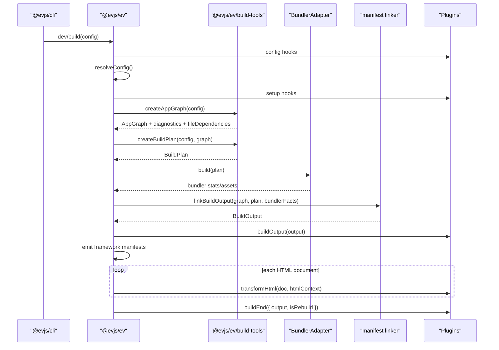
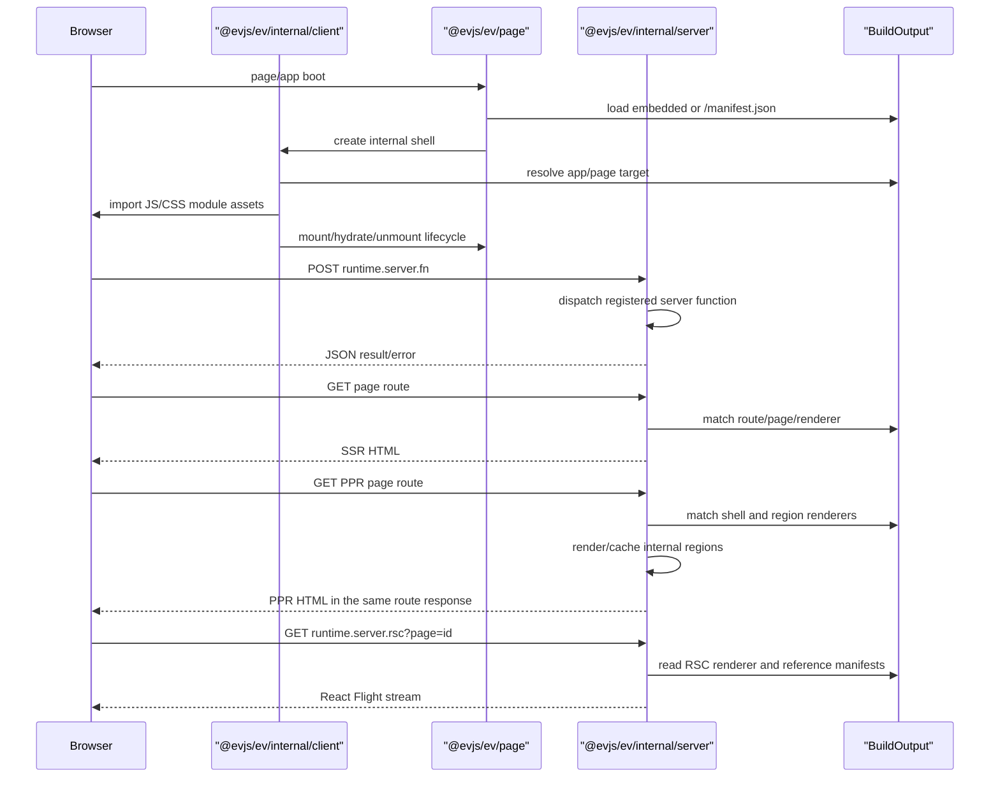
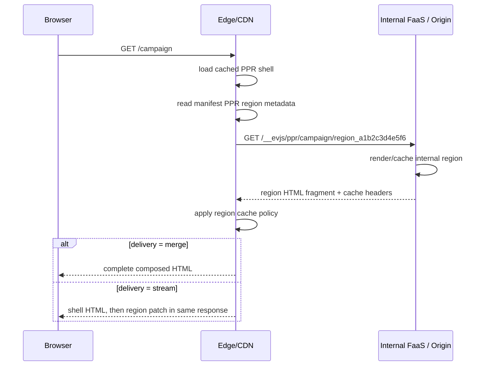

# 架构

evjs 是围绕文件约定、显式 source declaration、框架 graph、bundler 无关 build
plan，以及单一 runtime manifest 构建的 React 框架。框架托管的路由模型是文件化的：
客户端页面来自 `src/pages`，服务端文件路由来自 `src/apis`，server middleware
来自 `src/middleware.ts` 和 `src/apis/**/middleware.ts`。

```txt
src/pages + src/apis + src/middleware.ts + ev.config.ts
  -> AppGraph
  -> BuildPlan
  -> bundler build
  -> BuildOutput
  -> runtime / shell / deployment adapters
```

## 公共包

应用代码通过 `@evjs/ev` 导入 config、plugin、build、deployment 和能力组合
API。file-convention 应用还会从 `@evjs/ev/page`、`@evjs/ev/request` 和
`@evjs/ev/transport` 导入 curated authoring API；框架生成代码通过
`@evjs/ev/internal/*` 解析 client/server runtime internals。`@evjs/client`
和 `@evjs/server` 继续作为 standalone/manual runtime 包，供有意直接持有这些
surface 的应用使用。其他包是工具包、bundler adapter 或框架包之间共享的契约包。
需要新的能力边界时，先优先考虑在拥有该行为的包中增加 subpath export，再考虑
新增分发包。
Subpath export 必须保持显式且有文档说明；新增 package export 是公开 API 决策，
不是为了方便导入而增加的别名。

```txt
@evjs/ev
  config、插件生命周期、文件路由发现、dev/build 编排、框架构建类型、
  能力组合/校验、deployment helpers 和 file-convention authoring subpaths

@evjs/client
  standalone/manual 浏览器 runtime core、框架托管 page runtime、服务端函数
  transport、导航 primitives 和 RSC client runtime

@evjs/server
  Hono/fetch app、服务端函数、route primitives、request context 和
  SSR/PPR/RSC 请求处理的 standalone/manual 服务端 runtime core
```

`@evjs/cli` 和 `@evjs/create-app` 是分发工具包。Bundler adapter 保留在
`@evjs/bundler-utoopack` 和 `@evjs/bundler-webpack`，共享 runtime/manifest
契约保留在 `@evjs/shared`。`@evjs/ev` 通过配置解析、graph analysis、
build-plan 生成和 manifest 校验决定一个应用中能组合哪些 runtime 能力；
runtime 包提供具体能力原语。`@evjs/server` 的 `createApp()`、`createRoute()`
等编程式 API 是 runtime primitives，不是 evjs framework 的第二套路由声明模型；
框架托管的 server routes 使用 `src/apis`。

| 角色 | 包 | 导入建议 |
|------|----|----------|
| 框架面 | `@evjs/ev` | config/build/plugin/deployment API 和能力组合使用 `@evjs/ev`；file-convention 应用源码使用 `@evjs/ev/page`、`@evjs/ev/request` 和 `@evjs/ev/transport`。 |
| Standalone runtime API | `@evjs/client`, `@evjs/server` | 只有应用源码有意直接持有 standalone/manual CSR 或 server runtime primitives 时才使用这些包。 |
| 工具包 | `@evjs/cli`, `@evjs/create-app` | 用于安装或执行；应用模块不应 import 它们。 |
| Bundler adapter | `@evjs/bundler-utoopack`, `@evjs/bundler-webpack` | `@evjs/cli` 持有默认 Utoopack adapter；只有自定义工具时才直接 import adapter。 |
| 共享契约 | `@evjs/shared` | 发布出来是为了让框架包共享 manifest/runtime 类型；应用代码不应直接 import。 |

已发布包的 manifest 保持 ESM-only，并且发布面要刻意收窄。每个分发包都设置
`"type": "module"`，使用 public access 和 MIT license，只白名单发布生成产物：
框架、runtime、adapter 和契约包发布 `esm`；`@evjs/cli` 发布 `dist`/`bin`；
`@evjs/create-app` 发布 `dist`/`templates`。

内部 `@evjs/*` runtime 依赖也保持显式。`@evjs/ev` 消费 `@evjs/client`、
`@evjs/server` 和共享契约，因此 file-convention 应用可以只安装一个框架包，而生成
代码仍能到达 runtime cores。`@evjs/server` 会消费 `@evjs/client` 中的共享 runtime
类型。`@evjs/cli` 持有默认 Utoopack adapter 依赖，bundler adapter 依赖
`@evjs/ev`，而不是彼此依赖。内部 runtime 依赖版本保持为 `"*"`，让发布自动化
把所有分发包作为同一个框架版本处理。

生成专用的 `@evjs/ev/internal/client/*` 和 `@evjs/ev/internal/server/*`
subpath 用于让框架生成的路由声明、page bootstrap、server-function
stub/registration 和 RSC runtime entry 完成类型检查。应用代码从
`@evjs/ev/page`、`@evjs/ev/request` 或 `@evjs/ev/transport` 导入公开
authoring API，不要导入这些生成专用的 internal helper。
例如，`@evjs/ev/internal/client/route-types` 用于生成的 SPA 路由声明，
`@evjs/ev/internal/client/server-functions` 用于生成的 `"use server"` 客户端
stub，`@evjs/ev/internal/server/server-functions` 用于生成的 `"use server"`
服务端 registration，`@evjs/ev/internal/client/rsc-runtime` 用于 RSC page
bootstrap。

不要重新引入 `@evjs/build-tools`、`@evjs/manifest` 或 `@evjs/router-*`
这类历史拆分包。构建 helper 从 `@evjs/ev/build-tools` 导出，manifest
契约从 `@evjs/shared/manifest` 导出。

文档中的代码示例也遵循同一包边界：file-convention 应用示例从 `@evjs/ev`、
`@evjs/ev/page`、`@evjs/ev/request` 或 `@evjs/ev/transport` 导入；standalone
runtime 示例可以从 `@evjs/client` 或 `@evjs/server` 导入；只有展示自定义工具时，
adapter 示例才直接导入 `@evjs/bundler-utoopack`。

## 内部模块

```txt
@evjs/ev/build-tools
  源码分析、文件路由发现、服务端函数提取、graph/plan helpers、框架 transform、HTML helpers

@evjs/shared/manifest
  AppGraph、BuildPlan、BuildOutput 和 manifest schema

@evjs/ev generated-only runtime internals
  framework-managed runtime、shell、router-free react-page runtime、transport、
  RSC client runtime、SPA router 集成和 generated bootstrap，通过
  @evjs/ev/internal/* 子路径承载，并由 @evjs/client 和 @evjs/server internals 支撑

@evjs/bundler-utoopack
  @evjs/cli 使用的默认 bundler adapter

@evjs/bundler-webpack
  在 Utoopack 下层 API 补齐前，用于验证 SSR/PPR/RSC 以及 dynamic entry/server
  dev plan update 的 fallback adapter
```

`@evjs/ev/build-tools` 不 import bundler adapter。Bundler adapter 消费 `BuildPlan`，不会在 bundling 之后重新扫描源码来发现框架语义。
`@evjs/ev/build-tools` 子路径只暴露 CLI 和 bundler adapter 需要的 tooling API。
底层 module export 解析、server-function ID hashing 和 module-ref helper
保留为 `@evjs/ev` 私有实现。

TanStack Router 通过 `@evjs/client` 的 standalone CSR surface 提供给手写
浏览器应用使用。在框架托管应用中，`@evjs/ev` 负责文件路由发现和 generated
bootstrap，应用页面只写 `src/pages`、page hooks 和导航 helper，不需要创建
router bootstrap。Generated bootstrap 通过 `@evjs/ev/internal/client/*` 承载。
MPA 文件路由和显式 pages 使用 page runtime，不引入客户端路由器。
`@evjs/client` facade 暴露 standalone CSR、页面 hooks、导航、server function
和 RSC runtime API。

## 构建流程



构建会在 `dist/build-output.json` 输出完整私有 `BuildOutput` handoff artifact。
public manifest 路径来自 `output.client`，server manifest 路径来自
`output.server`。Deployment adapter 可以把等价的 runtime 数据内嵌进平台产物，
因此已部署的 server runtime 不必在启动时读取 `dist/build-output.json`。

## 运行时流程



PPR 首屏不会要求浏览器再请求 region endpoint。框架服务端可以对 page route 使用
`merge` 或 `stream` delivery。`merge` 是默认非流式模式，会在 shell 和 regions
都完成后返回最终合成 HTML。`stream` 会先发送 shell HTML，再在同一个 document
response 中发送 region patches。派生的 `runtime.server.ppr` endpoint 仍保留给
direct/debug 访问和 cache 验证使用。

在单个服务端进程里，region resolution 是框架内部调用。在 edge 部署里，同一份
契约可以拆到多层：edge 服务缓存的 shell，再通过 server-to-server 请求访问内源
origin/FaaS 的 dynamic region endpoint。浏览器仍然只看到页面 route：



因此 `GET /__evjs/ppr/...` 可能出现在 edge 到 origin 的服务端日志里，但不会出现在
浏览器网络日志里。长期运行时边界应是可替换的 region resolver：Node/dev 可以在
本进程调用 renderer，edge adapter 可以 fetch 内源 FaaS endpoint，而不改变公开页面协议。

推荐的 PPR 编写模型是 React `Suspense`。页面组件声明
`export const render = "ssr"`，并通过
`export const prerender = { partial: true, delivery }` 开启 partial
prerendering。PPR 是建立在 SSR 之上的 prerendering 策略，不是独立的 document
render mode。evjs 0.2 中这部分仍是 experimental：任意 Suspense boundary 的
runtime postponed/resume 尚未实现，当前兼容 splitter 只会为受限的 `Suspense` +
直接 `lazy(() => import(...))` 形态生成内部 region renderer。Region id 是框架
内部 opaque 细节。

PPR 页面在 public manifest 中的 page-level hydration 是 `none`。需要客户端交互时，
应通过显式 client islands 或 region-level hydration metadata 引入，而不是 hydrate 整个
PPR shell。

RSC Flight 请求也通过同一个 `@evjs/server` 边界进入。Flight endpoint 接受
`page=<id>` 和可选的 `url=<pathname+search>`；`page` id 必须是 manifest page id，
并遵循 build identifier 规则。URL context 必须是同源绝对 path 或 HTTP(S) URL，
且不能包含 hash。Webpack 验证路径已经使用 React Flight client consumption 和 React
client/server reference manifests；Utoopack 仍需要等价的下层 metadata 才能跑通同一路径。

## 配置归属

```txt
routing
  文件路由事实来源：spa/mpa mode、dir、html、mount point

server.routing
  服务端文件路由事实来源：dir、发现到的 HTTP method modules

entry/html
  手动单应用快捷配置

pages.*
  显式独立页面输出：path、entry/component/app、mount point

server.basePath
  派生 fn、ppr、rsc 等框架服务端路径

transport.baseUrl
  浏览器访问框架服务端的 base URL，被 framework 请求共享

plugins
  框架和 bundler 扩展点
```

`routing` 默认指向 `src/pages`。SPA 模式会把发现到的文件转成内部 TanStack
Router app entry；MPA 模式会把同一批文件转成不带客户端路由器的独立页面输出。

`server.routing` 默认指向 `src/apis`。服务端路由文件只有导出大写 HTTP methods
时才会成为 route。Middleware 按文件系统作用域从 `src/middleware.ts` 和
`src/apis/**/middleware.ts` 发现；route module 不导出 middleware，也不存在
`server.entry` 组合路径。

Page modules 通过文件名拥有 path-to-component wiring，并通过 `render`、`hydrate`、
`rsc`、`prerender` 等静态导出拥有渲染元信息。当 graph creation 发现 SSR、RSC
或 partial prerender metadata 时，会从该页面模块派生所需的 server renderers、
PPR regions、assets 和 manifest output。
完整 BuildOutput manifest 会显式保留这些 renderer 关系：SSR、SSG 和 RSC document page
通过由 page id 拥有的 `page-server` renderer 解析，或通过该 page 的某个 route id
拥有的 `page-server` renderer 解析。PPR 页面改由 `ppr-shell` 和 `ppr-region`
entry 解析。

`pages.*` 保留为显式底层页面 API。它适合页面无法自然映射到 `src/pages` 文件树的场景。
渲染元信息仍属于被引用的 page module，而不是 `ev.config.ts`。

## 服务端函数管线

```txt
"use server" module
  -> build-tools extraction
  -> client transform creates internal client references
  -> server transform/register path
  -> BuildOutput.server.functions
  -> framework server dispatches POST runtime.server.fn
```

公开配置只暴露 `server.basePath`；函数 endpoint 从这个 base path 派生。

RSC `use client` reference extraction 会在 `BuildOutput.rsc` 中保留 default
export、identifier export、class export、同模块 alias、namespace re-export
名称（例如 `export * as Widgets from "./widgets"`），以及包含字符串字面量
alias 的 re-export 名称。type-only export 会被忽略。client reference transform
会生成内部 binding 并通过 export specifier 导出，因此 reserved word 和字符串字面量
alias 仍是合法 JavaScript。
`BuildOutput.rsc.clientReferences` 和 `BuildOutput.rsc.serverReferences` 使用
提取出的 reference id 作为无首尾空白的字符串 key。这些 id 可以包含文件路径、URL
语法、`#` 或 `:`；value object 携带无首尾空白的 `module` 和可选 `exportName`。
只有 reference metadata 的 RSC output 可以省略 `BuildOutput.rsc.endpoint`；
包含 RSC page output 时不能省略，因为 Flight 请求需要明确的 endpoint。缺少
`runtime.server.rsc` 时，manifest linker 会拒绝 RSC page output。
在完整 BuildOutput manifest 中，每个 RSC page renderer reference 必须解析到
`owner.pageId` 匹配该 RSC page id 的 `rsc-page` renderer；公开 manifest
可以省略这些 server-only renderer metadata。
忽略 type-only 和 ambient declaration 后，`"use client"` 模块仍必须暴露至少一个
runtime client reference。
裸的 runtime `export * from "./widgets"` 会被拒绝，因为 framework manifest
必须知道每一个 client reference export name；请改用显式 named re-export 或
namespace re-export。
格式错误的 `"use client"` 模块会在 graph analysis 阶段报告文件路径和 parser
message，再进入 bundler transform 前即可定位问题。

## 部署

Deployment adapter 消费 `BuildOutput`。`@evjs/ev` 提供：

- `createDeploymentArtifact(output)`：生成平台中立的路由、资源和服务端 metadata；
- `nodeDeploymentAdapter()`：具体 Node 生产目标，输出 `dist/deployment.node.json`
  和 `dist/server.mjs`；
- `staticDeploymentAdapter()`：输出静态托管路由 metadata 和 `_redirects`；
- `edgeDeploymentAdapter()`：输出 edge worker 入口，由 worker 调用框架服务端 bundle
  和静态资源 binding。

平台专属 adapter 应从 `BuildOutput` 派生 routing、framework endpoint、SSR、PPR、RSC 和 asset metadata，而不是读取 bundler stats。
构建流水线中的 adapter 会在内存里收到这个对象；构建后的工具可以读取 `dist/build-output.json`。
完整 BuildOutput manifest 会保留源码 module 和 server renderer reference；公开/浏览器
manifest 保持相同的 routing 与 asset 结构，但会脱敏这些 server-only 字段，因此客户端
校验会把它们视为可选。

部署模型由能力分类驱动：

```txt
static-only
  CSR / MPA client entries / SSG / assets

unified node
  static assets + framework endpoints + SSR/PPR/RSC + server functions/routes

unified edge worker
  asset binding + edge-compatible framework server bundle

edge + origin/FaaS split
  edge caches assets/shells
  origin/FaaS resolves functions, routes, SSR/RSC, and PPR regions
```

Adapter 应先分类 `BuildOutput`，再输出平台路由。Static hosting 不应声明支持 SSR、
PPR、RSC、server functions 或 server routes，除非同时接入具备服务端能力的 runtime。

## Dev 更新

框架级文件约定变化和普通 HMR 分开处理：

```txt
config / page route / server file-route / middleware convention change
  -> recreate AppGraph
  -> recreate BuildPlan
  -> diff BuildPlan
  -> if BuildPlan changes:
       bundlerDevController.updatePlan(update, nextGraph)
  -> if graph-only:
       refresh active graph + dependency watchers
```

默认 Utoopack adapter 可以通过现有 build stats 重新链接 HTML-only plan update。
dynamic entry 和 server renderer update 仍会返回明确 unsupported error，直到 Utoopack
暴露下层 API。webpack adapter 可在进程内应用这些更宽的 update，用于架构验证。样式和
资源编辑仍走 bundler HMR 路径。server function 和 server route 的实现编辑通常保持同一个
`BuildPlan`；此时框架只刷新 graph metadata 和 watch inputs，更新后的代码由 bundler
的普通 server watch 输出。

Graph analysis 会读取页面路由模块、服务端文件路由模块、middleware convention
modules 和静态 import closure 来发现 server functions、page metadata 和 RSC
references。静态 import closure discovery 会解析模块，因此会跟随普通 import、
re-export 和合法的字符串字面量 import alias；字面量 dynamic import 指向项目相对模块时也会被跟踪。
dev 会 watch 页面路由目录、服务端路由目录、显式 graph roots，以及已经包含
framework marker 的文件。显式配置的 page component 属于 graph root，因为它的静态
`render`、`hydrate`、`rsc`、`prerender` 导出会影响 framework planning。普通组件、
app entry 和样式编辑继续走 bundler HMR，除非这些模块声明了 framework marker。
