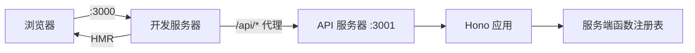

# 开发服务器

## 命令

```bash
ev dev
```

无需参数 —— 配置来自 `ev.config.ts` 或基于约定的默认值。

## 工作原理

`ev dev` 会同时启动**两个服务器**：

| 服务器 | 默认端口 | 用途 |
|--------|---------|------|
| **开发服务器** | `3000` | 具有模块热替换（HMR）的客户端 bundle |
| **API 服务器** | `3001` | 服务端函数 + 路由处理器，首次构建后自动启动 |

客户端开发服务器会自动将 `/api/*` 请求代理到 API 服务器。



## 配置

```ts
// ev.config.ts
import { defineConfig } from "@evjs/ev";

export default defineConfig({
  entry: "./src/main.tsx",         // 默认值
  html: "./index.html",            // 默认值
  dev: {
    port: 3000,                   // 客户端服务器端口
    https: false,                 // HTTPS 模式
  },
  server: {
    functions: {
      endpoint: "/api/fn",         // 默认值
    },
    dev: {
      port: 3001,                 // API 端口
      https: false,               // API 服务器 HTTPS
    },
  },
});
```

## 运行机制细节

1. `loadConfig(cwd)` 加载 `ev.config.ts`。
2. `resolveConfig()` 应用默认值，然后 `plugin.setup()` 收集生命周期钩子。
3. `hooks.buildStart()` 在编译之前运行。
4. 调用 `BundlerAdapter.dev()`（将插件的 `bundlerConfig` 钩子应用到配置上）。
5. 启动客户端 HMR 服务器（例如 `dev server`）。
6. 在扫描到服务端后，适配器触发 `onServerBundleReady` 信号。
7. CLI 核心通过 `@evjs/server/node` 自动启动 API 服务器。
8. 设置反向代理：`devServer.proxy["/api"] → localhost:3001`。

## API 服务器运行时

开发模式下，evjs 会通过一个小型 Node bootstrap 运行已构建的服务端 bundle，并调用 `@evjs/server/node`。生产环境中，应根据目标宿主环境选择合适的运行时包装来部署产出的 `{ fetch }` handler。

## 编程式 API

`ev dev` 和 `ev build` 也可以在代码中编程式调用：

```ts
import { dev, build } from "@evjs/ev";
import { utoopackAdapter } from "@evjs/bundler-utoopack";

// 使用显式构建器适配器启动开发服务器
await dev({ dev: { port: 3000 } }, { cwd: "./my-app", bundler: utoopackAdapter });

// 运行生产构建
await build({ entry: "./src/main.tsx" }, { cwd: "./my-app", bundler: utoopackAdapter });
```

`@evjs/cli` 也导出兼容包装函数，会自动注入默认的 utoopack 适配器，与 `ev dev` 和 `ev build` 命令保持一致。

## 传输层

`createApp()` 会自动调用 `initTransport`，用以配置客户端如何与服务端通信。

- 在**开发模式**中：客户端服务器代理 `/api/*` → `:3001`，所以默认的 `/api/fn` 端点会自动生效
- 在**生产模式**中：客户端和服务端通常在同一个源下
- 通信层**与运行时无关** —— 无论后端使用何种运行时，客户端始终会将 POST 请求发送至正确的相同端点
