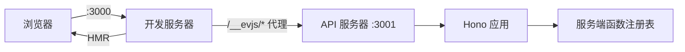

# 开发服务器

## 命令

```bash
ev dev
```

无需参数 —— 配置来自 `ev.config.ts` 或基于约定的默认值。

## 工作原理

`ev dev` 会同时启动**两个服务器**：

| 服务器 | 默认端口 | 用途 |
|--------|---------|------|
| **开发服务器** | `3000` | 具有模块热替换（HMR）的客户端 bundle |
| **API 服务器** | `3001` | 服务端函数 + 路由处理器，首次构建后自动启动 |

客户端开发服务器会自动将解析后的框架服务端运行时路径代理到 API 服务器。
默认情况下这些路径来自 `server.basePath`，包括 `/__evjs/fn`、`/__evjs/ppr`
和 `/__evjs/rsc`；显式配置的 `server.rsc.endpoint` 也会按框架运行时路径处理。
SPA history fallback 会跳过 `/api` 和这些解析后的框架运行时路径，因此拼错的 API
或框架运行时请求会返回代理/服务端 404，而不是 `index.html`。



## 配置

```ts
// ev.config.ts
import { defineConfig } from "@evjs/ev";

export default defineConfig({
  entry: "./src/main.tsx",         // 默认值
  html: "./index.html",            // 默认值
  dev: {
    port: 3000,                   // 客户端服务器端口
    https: false,                 // HTTPS 模式
  },
  server: {
    basePath: "/__evjs",          // 服务端函数/PPR/RSC 路径从这里派生
    dev: {
      port: 3001,                 // API 端口
      https: false,               // API 服务器 HTTPS
    },
  },
});
```

`dev.port` 和 `server.dev.port` 必须是 `1` 到 `65535` 之间的 TCP 端口整数。
自定义 `dev.proxy` 规则必须提供非空 `context` pathname pattern 数组和非空
absolute HTTP(S) URL `target`。Context pattern 必须以 `/` 开头，不能包含空白字符、
query string 或 hash，并且同一条规则内不能重复。Target 不能包含首尾空白字符。
启用 framework server 时，evjs 会把这些规则放在 `/__evjs/*` 框架代理之前。

## 运行机制细节

1. `loadConfig(cwd)` 加载 `ev.config.ts`。
2. `resolveConfig()` 应用默认值，然后 `plugin.setup()` 收集生命周期钩子。
3. `hooks.buildStart()` 在编译之前运行。
4. 调用 `BundlerAdapter.dev()`（将插件的 `bundlerConfig` 钩子应用到配置上）。
5. 启动客户端 HMR 服务器（例如 `dev server`）。
6. 在扫描到服务端后，适配器触发 `onServerBundleReady` 信号。
7. CLI 核心通过 `@evjs/server/node` 自动启动 API 服务器。
8. 为派生出的框架运行时路径设置反向代理，例如 `/__evjs/fn`、`/__evjs/ppr`
   和 `/__evjs/rsc` → `localhost:3001`。

## API 服务器运行时

开发模式下，evjs 会通过一个小型 Node bootstrap 运行已构建的服务端 bundle，并调用 `@evjs/server/node`。生产环境中，应根据目标宿主环境选择合适的运行时包装来部署产出的 `{ fetch }` handler。

## 编程式 API

`ev dev` 和 `ev build` 也可以在代码中编程式调用：

```ts
import { dev, build } from "@evjs/ev";
import { utoopackAdapter } from "@evjs/bundler-utoopack";

// 使用显式构建器适配器启动开发服务器
await dev({ dev: { port: 3000 } }, { cwd: "./my-app", bundler: utoopackAdapter });

// 运行生产构建
await build({ entry: "./src/main.tsx" }, { cwd: "./my-app", bundler: utoopackAdapter });
```

`bundler` option 和 `ev.config.ts` 中的 adapter 契约一致：必须是 object，且包含非空
`name` 以及 `build` / `dev` 函数。

`@evjs/cli` 也导出兼容包装函数，会自动注入默认的 utoopack 适配器，与 `ev dev` 和 `ev build` 命令保持一致。

`@evjs/bundler-utoopack` 是默认 dev adapter。它可以不重启 `ev dev` 刷新
HTML-only framework plan 变化；新增或删除配置化 entry 仍需要重启，直到 Utoopack
暴露 entry update API。`@evjs/bundler-webpack` 也可以运行开发模式，用于架构验证，
并能在进程内处理更宽的 `updatePlan(update, graph)` 变化。

## 传输层

默认 HTTP 传输不需要应用代码配置。只有在需要定制内置 HTTP 适配器，
或替换为自定义适配器时，才需要在应用启动时调用 `initTransport()`。

- 在**开发模式**中：客户端服务器代理派生出的框架服务端路径，例如
  `/__evjs/fn`、`/__evjs/ppr` 和 `/__evjs/rsc` → `:3001`
- 在**生产模式**中：客户端和服务端通常在同一个源下
- 通信层**与运行时无关** —— 无论后端使用何种运行时，客户端始终会将 POST 请求发送至正确的相同端点
- 内置 HTTP 适配器通过 `credentials` 和 `headers` 配置；fetch `mode` 不提供配置
