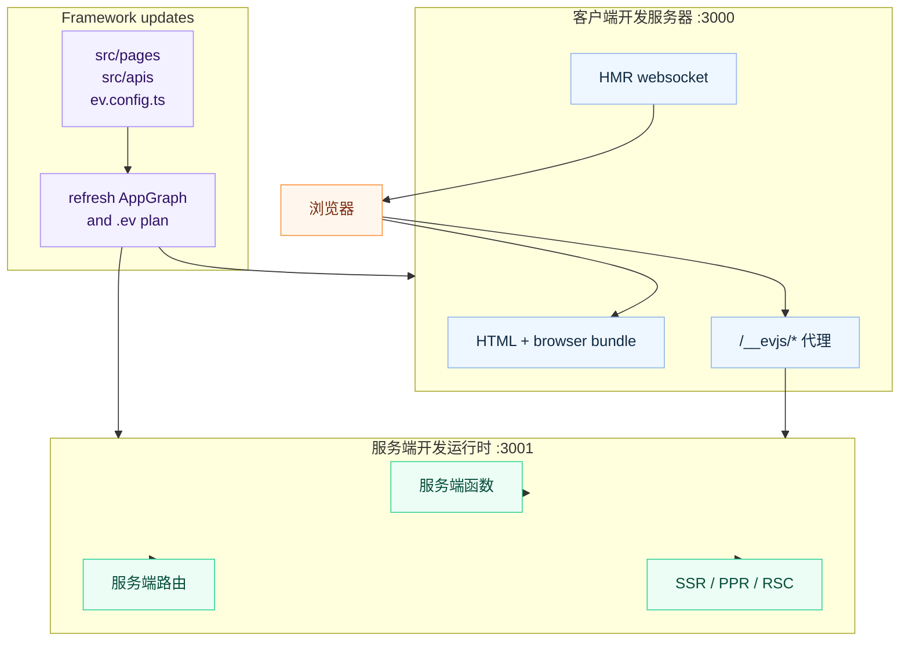

# 开发服务器

## 命令

```bash
ev dev
```

无需参数。配置来自 `ev.config.ts` 或基于约定的默认值。

## 启动内容

`ev dev` 会启动面向浏览器的开发服务器；当应用使用服务端能力时，还会启动服务端开发运行时：

| 服务器 | 默认端口 | 用途 |
| --- | --- | --- |
| **客户端开发服务器** | `3000` | 浏览器 bundle、HTML 和模块热替换（HMR）。 |
| **服务端开发运行时** | `3001` | 服务端函数、服务端文件路由、SSR、PPR 和 RSC 请求。 |

客户端开发服务器会把服务端运行时路径代理到服务端开发运行时。默认情况下这些路径来自
`server.basePath`，包括 `/__evjs/fn`、`/__evjs/ppr` 和 `/__evjs/rsc`。

SPA history fallback 不会接管 `/api` 或派生出的服务端运行时路径。因此拼错的服务端请求会返回
服务端/代理 404，而不是应用 HTML。



## 配置

```ts
// ev.config.ts
import { defineConfig } from "@evjs/ev";

export default defineConfig({
  dev: {
    port: 3000,                   // 客户端开发服务器端口
    https: false,                 // 客户端开发服务器 HTTPS
  },
  server: {
    basePath: "/__evjs",          // 服务端运行时路径从这里派生
    dev: {
      port: 3001,                 // 服务端开发运行时端口
      https: false,               // 服务端开发运行时 HTTPS
    },
  },
});
```

约定式 `src/pages` 应用不需要配置 `entry`。发现页面路由后，
开发服务器会使用生成的页面应用入口。

`dev.port` 和 `server.dev.port` 必须是 `1` 到 `65535` 之间的 TCP 端口整数。
自定义 `dev.proxy` 规则必须提供非空 `context` pathname pattern 数组，以及 absolute
HTTP(S) URL `target`。Context pattern 必须以 `/` 开头，不能包含空白字符、query string
或 hash，并且同一条规则内不能重复。Target 不能包含首尾空白字符。使用
`pathRewrite` 可以在转发到 target 前改写被代理的请求路径。

自定义代理规则会先于服务端运行时路径的内置代理应用，因此应用自己的 API proxy 可以保留独立的路由行为。

## 请求流

1. 客户端开发服务器提供浏览器代码和 HMR。
2. 服务端函数、服务端文件路由、SSR、PPR 和 RSC 请求会进入服务端开发运行时。
3. 从 `server.basePath` 派生的路径会自动代理。
4. 文件变化时会触发浏览器和服务端重建；修改配置化 entry 或路由根目录后需要重启 `ev dev`。

## 编程式 API

`ev dev` 和 `ev build` 也可以在代码中编程式调用：

```ts
import { dev, build } from "@evjs/cli";
import { utoopackAdapter } from "@evjs/bundler-utoopack";

// 使用显式构建器适配器启动开发服务器
await dev({ dev: { port: 3000 } }, { cwd: "./my-app", bundler: utoopackAdapter });

// 为约定式页面路由运行生产构建
await build({ routing: { mode: "spa" } }, { cwd: "./my-app", bundler: utoopackAdapter });
```

`bundler` option 和 `ev.config.ts` 中的 adapter 契约一致：必须是 object，且包含非空
`name` 以及 `build` / `dev` 函数。

`@evjs/cli` 也导出兼容包装函数，会自动注入默认的 Utoopack 适配器，与 `ev dev`
和 `ev build` 命令保持一致。

## 传输层

默认 HTTP 传输不需要应用代码配置。只有在需要定制内置 HTTP 适配器，或替换为自定义适配器时，
才需要在应用启动时调用 `initTransport()`。

- 在**开发模式**中，客户端开发服务器会把 `/__evjs/fn`、`/__evjs/ppr`、
  `/__evjs/rsc` 等服务端运行时路径代理到服务端开发运行时。
- 在**生产模式**中，客户端和服务端通常在同一个源下。
- 当浏览器发起的服务端函数请求需要访问另一个 origin 时，使用 `transport.baseUrl`。
- 内置 HTTP 适配器通过 `credentials` 和 `headers` 配置；fetch `mode` 不提供配置。
