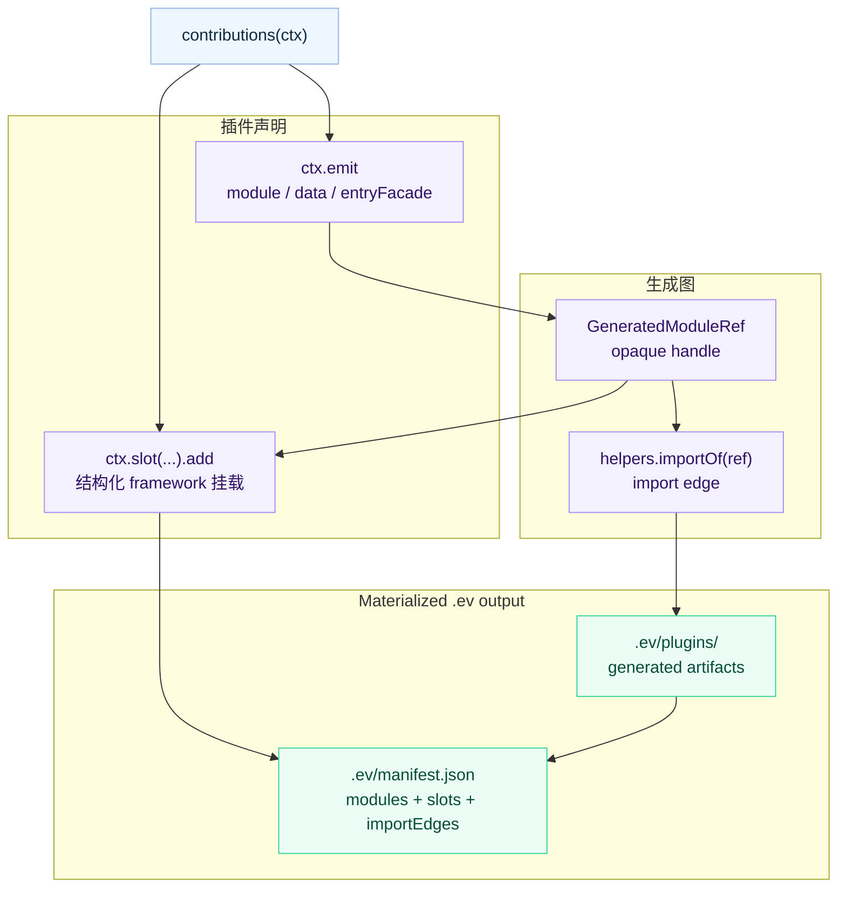

# Generated Contributions IR

`.ev` 是 evjs build 的 agent-readable framework IR。它记录 file convention 发现了
什么、框架生成了哪些 entry、插件添加了哪些产物，以及这些生成产物如何挂到 framework
slots 上。

## 概念

Contribution 是 framework IR 里的声明式单元。它可以生成产物、把这些产物链接起来，
并把它们挂到 framework slot 上。

这个定义刻意比任意临时文件系统更窄。插件不会随意向 `.ev` 写文件；插件声明 artifact
和关系，由 evjs 统一 materialize 最终 `.ev` 目录和 manifest。



## 目录结构

```txt
.ev/
├── framework/
│   ├── app-graph.json
│   └── build-plan.json
├── entries/
│   ├── main.ts
│   └── server.ts
├── plugins/
│   └── qiankun/
│       └── slave/
│           ├── entry-wrapper.ts
│           └── original-entry.ts
├── manifest.json
└── types.d.ts
```

这个结构稳定且可读：

- `framework/` 保存 convention discovery 和 build-plan 快照。
- `entries/` 保存 bundler 消费的框架 entry facade。
- `plugins/<plugin>/` 保存插件生成产物。
- 插件名会规范化为路径段；例如 `@evjs/plugin-qiankun:slave` 会变成
  `qiankun/slave`。
- `manifest.json` 串联 generated artifacts、import edges、slot items、生产插件名、
  scope 和最终 entries。

生成文件在需要 framework runtime internals 时可以 import generated-only
`@evjs/ev/_internal/*` helper。插件源码不应 import 这些 subpath；插件 authoring 使用
`@evjs/ev/plugin`。`ctx.framework` 对象是 immutable 的，插件可以 inspect IR，但不能修改
framework state。

## Authoring API

使用 `ctx.emit.module()` 声明生成代码，使用 `ctx.emit.data()` 声明生成 JSON 数据。
当 wrapper 插件需要替换 entry、但仍要保留被替换前的框架生成 entry 时，使用
`ctx.emit.entryFacade()`。

使用 `ctx.emit.importOf(ref)` 或 `helpers.importOf(ref)` 链接 generated artifacts。
返回的 specifier 只应在生成源码中使用。应用源码不应 import `.ev` 路径或
`evjs:generated/*` specifier。

使用 `ctx.slot(name).add(...)` 把 generated artifacts 挂到 framework 上。v1 支持的
slots 如下：

| Slot | 覆盖能力 |
|------|----------|
| `client.entry` | Entry imports、entry wrapper modules 和 replacement wrappers |
| `client.runtime.plugin` | Runtime plugin modules 和 export keys |
| `client.route` | 受约束的 SPA route additions 或 route-module replacements |
| `server.request.middleware` | Server pipeline 中的 framework request middleware |
| `html.tag` | 结构化 `meta`、`link`、`script`、`style` tags |
| `resolve.alias` | 指向用户模块、package、绝对路径或 generated artifacts 的语义化 alias |
| `resolve.external` | Externalized module resolution，通常和 `html.tag` CDN 资源配合 |

`client.route` 刻意比任意 route tmp file 更窄。它可以用稳定 route id 和 path 追加一个
generated route module，也可以替换已有 generated route id 的 module。它不能修改无关
route metadata、创建第二套路由方言，或绕过 file conventions 使用的 path/parent 校验。

`client.runtime.plugin` module 会传给生成的 SPA runtime。Runtime plugin 可以导出
`patchRoutes`、`patchClientRoutes`、`modifyRouterOptions`、`wrapRoot`、
`rootContainer` 或 `render`。需要在 `.ev/manifest.json` 中可见的静态 route IR 使用
route slot；最终路由列表必须依赖浏览器运行时状态时，才使用 runtime route hook。

## 边界

Generated contributions 是 file-convention entry 组合，以及插件 entry/runtime/html/resolution
注入的 source of truth。不要为了这些职责重新引入旧的 virtual entry loader。

Contribution 层不替代插件生命周期：

- 用 `config()` 处理 framework config 默认值或需要早期校验的配置。
- 用 `setup()` 初始化插件状态并返回 lifecycle hooks。
- 用 `bundlerConfig()` 处理尚未被 slot 建模的底层 bundler 能力。
- 用 `transformHtml()` 处理 AST 级 HTML 改写。
- 用 `buildOutput()` 和 `buildEnd()` 处理部署 metadata 和最终文件。

这个拆分让 IR 保持可读，同时不假装所有插件能力都是 entry contribution。

## Agent 工作流

调试或 code review 时，先看 `.ev/manifest.json`：

1. 在 `entries` 中找到最终 entry。
2. 查看 `generated.modules`，确认插件产物和 producer plugin。
3. 查看 `generated.slots`，确认产物挂载位置。
4. 查看 `generated.importEdges`，理解 generated-to-generated import。
5. 打开 `.ev/entries` 和 `.ev/plugins` 下对应文件。

这让 agent 和人类都能看到完整的框架生成代码，而不是被 loader 或任意 tmp file 隐藏。
