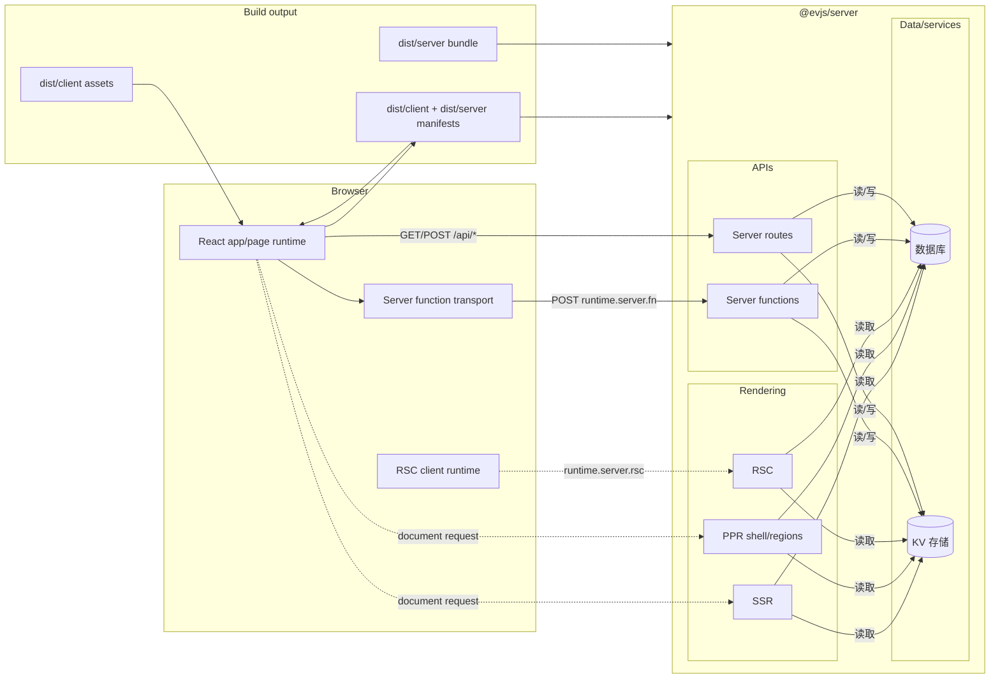

# 什么是 evjs？

> **ev** = **Ev**aluation（执行）· **Ev**olution（演进）—— 跨运行时执行，借助 AI 工具演进。

evjs 是一个零配置的 React 全栈框架，提供基于页面的客户端路由、服务端函数、路由处理器、SSR、PPR、RSC 集成点，以及面向部署的输出。

框架会明确区分：

- **应用代码**：React pages、服务端函数、服务端路由；
- **框架语义**：`AppGraph`、`BuildPlan`、`BuildOutput`；
- **构建器**：默认 Utoopack，webpack 作为新架构能力验证 adapter；
- **运行时/服务端/部署 adapter**：消费框架 manifest，不读取 bundler stats。

SPA 页面路由把导航、loader、search 和 params 语义保留在框架内部。MPA 页面路由使用 page runtime，不引入客户端路由器。

## 特性

- **零配置页面路由** —— 项目没有声明显式 `app` 或 `pages` 配置时，`ev dev` / `ev build` 会发现 `src/pages`。
- **SPA 与 MPA 模式** —— `routing.mode: "spa"` 生成一个框架托管的 app；`"mpa"` 生成多个无路由器页面。
- **框架托管页面** —— 页面模块可以把 CSR/SSR/SSG/PPR/RSC 渲染元信息写在组件旁边。
- **服务端函数** —— `"use server"` 模块变成浏览器可调用的 RPC stub。
- **服务端路由** —— 通过 `createRoute()` 编写标准 Web `Request`/`Response` route handler。
- **统一服务端边界** —— `@evjs/server` 处理 server functions、server routes、SSR、PPR、RSC。
- **插件系统** —— config、bundler、output、HTML、build 生命周期 hooks。
- **部署输出** —— 单一 public-safe framework manifest，加 adapter 生成的平台产物。

## 全栈架构

## 当前架构一句话

evjs 将页面路由和显式 server/page 元信息分析成 `AppGraph`，派生 bundler-independent `BuildPlan`，再把 bundler facts 链接成单一 `BuildOutput`。运行时、服务端、远程应用和部署 adapter 消费这个输出，插件扩展受支持的生命周期阶段。
