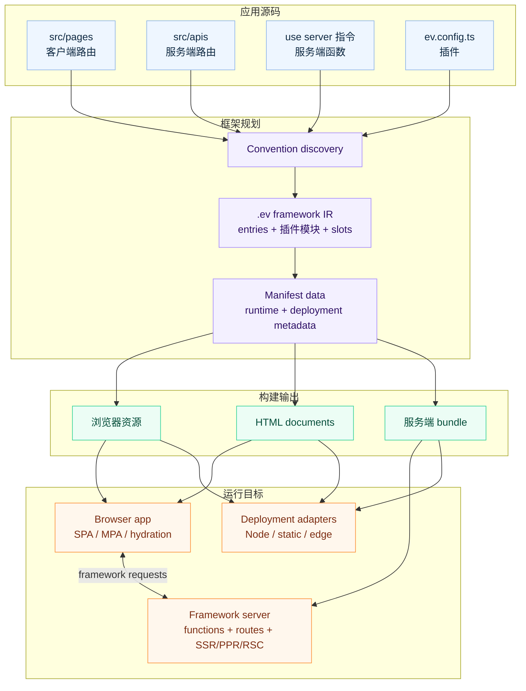

# 什么是 evjs？

> **ev** = **Ev**aluation（执行）· **Ev**olution（演进）—— 跨运行时执行，借助 AI 工具演进。

evjs 是一个零配置的 React 全栈框架，提供基于页面的客户端路由、服务端函数、
路由处理器、SSR、PPR、RSC 集成点，以及面向部署的输出。

框架会明确区分：

- **应用代码**：React 页面、服务端函数、服务端路由；
- **文件约定**：`src/pages`、`src/apis`、middleware 和服务端专用模块；
- **框架 IR**：生成的 `.ev` entries、插件产物、slots 和 manifest 数据；
- **构建器**：默认 Utoopack，webpack 可作为验证适配器；
- **部署产物**：浏览器资源、可选服务端 bundle，以及部署元信息。

SPA 页面路由把导航、loader、search 和 params 语义保留在框架内部。MPA 页面路由使用
page runtime，不引入客户端路由器。

## 特性

- **零配置页面路由** —— 项目没有声明显式 `app` 或 `pages` 配置时，`ev dev` / `ev build` 会发现 `src/pages`。
- **SPA 与 MPA 模式** —— `routing.mode: "spa"` 生成一个应用；`"mpa"` 生成多个无路由器页面。
- **渲染模式** —— 页面模块可以把 CSR、SSR、SSG、PPR 或 RSC 行为写在组件旁边。
- **服务端函数** —— `"use server"` 模块会变成浏览器可调用的函数。
- **服务端路由** —— 从 `src/apis` 发现标准 Web `Request`/`Response` route handler。
- **统一服务端运行时** —— 服务端函数、服务端路由、SSR、PPR、RSC 共用同一条服务端边界。
- **Agent-readable framework IR** —— `.ev` 在 bundling 前记录生成 entry、插件模块、slot 挂载、import edges 和 manifest 数据。
- **插件系统** —— 用 generated contributions 扩展 framework IR，并用 config、bundler、HTML、build output 和 build 生命周期 hooks 处理非 IR 能力。
- **部署输出** —— 静态资源，加上可选的 Node、静态托管或 edge 部署产物。

## 全栈架构

## 如何组合

evjs 从 `src/pages` 发现页面路由，从 `src/apis` 发现服务端文件路由，并从可达的
`"use server"` 模块发现服务端函数。随后它会 materialize `.ev` 作为 framework IR：
生成的 entry facade、插件 generated modules、结构化 slot 挂载，以及可供 agent 和工具在
bundler 执行前检查的 manifest。

`ev build` 会消费这层 IR 输出浏览器文件；当应用使用服务端能力时，还会输出可部署到 Node、
静态托管、edge worker 或 CDN/origin 拆分架构的服务端 bundle。
