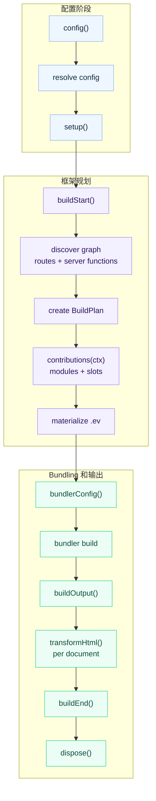

# 插件

evjs 插件扩展受支持的框架阶段，也可以在需要时修改当前 bundler 配置。多数插件面向
config、bundler config、HTML 文档和最终构建结果工作。

## 快速示例

```ts
import { defineConfig } from "@evjs/ev";

export default defineConfig({
  plugins: [
    {
      name: "build-timer",
      setup() {
        const start = Date.now();
        return {
          buildEnd({ output }) {
            console.log(`Build ${output.buildId} finished in ${Date.now() - start}ms`);
            console.log(Object.keys(output.assets).length, "entry asset groups");
          },
        };
      },
    },
  ],
});
```

## 插件结构

```ts
import type { Config, DefaultBundlerConfig, ResolvedConfig } from "@evjs/ev/config";
import type { ContributionContext, Plugin, PluginConfigContext, PluginContext, PluginHooks } from "@evjs/ev/plugin";

interface Plugin<TBundlerConfig = DefaultBundlerConfig> {
  name: string;
  dependencies?: string[];
  optionalDependencies?: string[];
  enforce?: "pre" | "normal" | "post";

  config?(config: Config<TBundlerConfig>, ctx: PluginConfigContext):
    | Config<TBundlerConfig>
    | undefined
    | Promise<Config<TBundlerConfig> | undefined>;

  setup?(ctx: PluginContext<TBundlerConfig>):
    | PluginHooks<TBundlerConfig>
    | undefined
    | Promise<PluginHooks<TBundlerConfig> | undefined>;

  contributions?(ctx: ContributionContext<TBundlerConfig>):
    | void
    | Promise<void>;
}
```

插件名必须唯一。提供 `config` 和 `setup` 时，它们必须是函数。`dependencies` 和
`optionalDependencies` 控制排序，并同时作用于 `config()` 和 `setup()`。依赖列表中
的 plugin name 必须非空且不能重复；同一个 plugin name 不能同时出现在
`dependencies` 和 `optionalDependencies` 中。evjs 会忽略 plugin object 上的额外
metadata 字段，让插件可以保留插件包自己的元信息。

## Config Hook

`config()` 用于修改必须早于默认值解析、路由发现、dev proxy 或运行时路径派生的框架配置。
它可以返回 config object，也可以在原对象上就地修改后返回 `undefined`。`null`、
array 和其他返回值会被拒绝。最终配置会经过和用户配置相同的 resolver 校验，然后才会
运行 `setup()` hooks 或开始 bundling。

```ts
import { defineConfig } from "@evjs/ev";
import { merge } from "@evjs/ev/config";

export default defineConfig({
  plugins: [
    {
      name: "server-base-path",
      config(config) {
        merge(config, {
          server: {
            basePath: "/_framework",
          },
        });
        return config;
      },
    },
  ],
});
```

不要用 `bundlerConfig()` 修改框架协议路径。服务端函数、PPR、RSC endpoint 都从
`server.basePath` 派生。

## Setup 上下文

```ts
interface PluginContext<TBundlerConfig = DefaultBundlerConfig> {
  mode: "development" | "production";
  command: "dev" | "build";
  cwd: string;
  config: ResolvedConfig<TBundlerConfig>;
  logger: Logger;
  addWatchFile(file: string): void;
}
```

在 `setup()` 中初始化共享状态并返回生命周期 hooks。返回值必须是 hooks object 或
`undefined`；`null`、array 和非函数 hook 字段会在生命周期 hooks 运行前被拒绝。
插件在返回对象上挂载插件包自有 metadata 时，未知 hook key 会被忽略。

## 生命周期



| Hook | 用途 |
|------|------|
| `buildStart(ctx)` | 路由发现和 bundling 前的构建准备 |
| `bundlerConfig(config, ctx)` | 修改当前 bundler 配置 |
| `buildOutput(output, ctx)` | 向构建输出添加部署/runtime metadata |
| `transformHtml(doc, ctx)` | 逐个 HTML 文档修改输出；接收当前 manifest result 字段 |
| `buildEnd({ output, isRebuild })` | 构建后输出最终产物 |
| `dispose(ctx)` | 清理资源 |

## Generated Contributions

Contribution 是 framework IR 里的声明式单元。它可以生成产物、把这些产物链接起来，
并把它们挂到 framework slot 上。

当插件需要扩展生成的 `.ev` IR 时，使用 `contributions()`。这一层适合处理 entry import、
runtime plugin module、受约束的 SPA route addition、HTML tag、framework request
middleware 和语义化 resolution 变更。真正需要 bundler transform 的场景，例如编译
自定义文件类型，仍应使用 loader。

`.ev` 是生成产物，包含：

- `.ev/framework/app-graph.json`：file-convention 发现后的 graph；
- `.ev/framework/build-plan.json`：最终的 bundler 无关 build plan；
- `.ev/entries/*`：bundler 消费的框架 entry facade；
- `.ev/plugins/<plugin>/*`：插件生成模块和 entry facade；
- `.ev/manifest.json`：graph、generated artifacts、slots、import edges 和最终 entries。

Contribution 模型由四部分组成：

| 概念 | 语义 |
|------|------|
| Generated artifact | 通过 `ctx.emit` 声明的 module、data file 或 framework entry facade。 |
| Opaque ref | `ctx.emit` 返回的 `GeneratedModuleRef`；插件拿不到 `.ev` 文件路径。 |
| Link edge | 通过 `ctx.emit.importOf(ref)` 或 `helpers.importOf(ref)` 声明的 generated-to-generated import。 |
| Slot item | 通过 `ctx.slot(name).add(...)` 声明的结构化挂载。 |

`ctx.framework` 是 immutable/read-only 的公开 framework IR view。它暴露 entries、apps、
pages、routes、server routes 和 server functions，但不暴露内部 `BuildPlan` 或
`AppGraph` 对象。插件代码应从 `@evjs/ev/plugin` 导入 authoring 类型；
`@evjs/ev/_internal/*` 只用于 CLI tooling、bundler adapter 和框架生成代码。

插件生成模块使用 opaque ref，不暴露文件系统路径：

```ts
import type { Plugin } from "@evjs/ev/plugin";

export function analyticsPlugin(): Plugin {
  return {
    name: "analytics",
    contributions(ctx) {
      const runtime = ctx.emit.module({
        id: "runtime",
        scope: { kind: "app" },
        source: "export function install() { console.log('analytics'); }",
      });

      const entry = ctx.emit.module({
        id: "entry",
        scope: { kind: "app" },
        source: ({ importOf }) =>
          `import { install } from ${JSON.stringify(importOf(runtime))};\ninstall();`,
      });

      ctx.slot("client.entry").add({
        id: "entry",
        module: entry,
        position: "after-main",
      });
    },
  };
}
```

当插件需要替换 entry、但仍要保留原始 framework facade 时，使用
`ctx.emit.entryFacade()`，不要在插件里重建 framework internal：

```ts
contributions(ctx) {
  const entry = ctx.framework.getPagesAppEntry();
  if (!entry) return;

  const original = ctx.emit.entryFacade({
    id: "original-entry",
    entry,
  });

  const wrapper = ctx.emit.module({
    id: "entry-wrapper",
    scope: { kind: "app" },
    source: ({ importOf }) =>
      `export const load = () => import(${JSON.stringify(importOf(original))});`,
  });

  ctx.slot("client.entry").add({
    id: "entry-wrapper-slot",
    module: wrapper,
    position: "before-main",
    mode: "replace",
  });
}
```

插件生成路径稳定且可读。例如名为 `@evjs/plugin-qiankun:slave` 的插件会写入
`.ev/plugins/qiankun/slave/*`，并暴露类似
`evjs:generated/qiankun/slave/entry-wrapper` 的 specifier。

可用 slots：

| Slot | 用途 |
|------|------|
| `client.entry` | 在 `polyfill`、`before-main-imports`、`after-main-imports`、`before-main` 或 `after-main` 位置向客户端 entry 添加生成模块 |
| `client.runtime.plugin` | 注册 runtime plugin module 和可选 export keys |
| `client.route` | 追加 generated SPA routes，或替换已有 SPA route id 的 module |
| `server.request.middleware` | 向服务端请求 pipeline 添加 framework request middleware |
| `html.tag` | 添加结构化的 `meta`、`link`、`script` 或 `style` tag |
| `resolve.alias` | 将模块 specifier 重定向到用户模块、package、绝对路径或 generated module |
| `resolve.external` | 声明某个 specifier 由外部 runtime 提供；CDN tag 应另行通过 `html.tag` 注入 |

当平台插件需要让 agent 和 inspect 工具看见 route IR 时，使用 `client.route`。Append
模式需要提供 `path`，并用声明的 `routeId` 创建 route；replace 模式需要指向已有
generated route id，除非显式声明新 path，否则保留当前 route path。当 route 或 render
行为必须在浏览器中决定时，runtime plugin 仍可以导出 `patchRoutes`、
`patchClientRoutes`、`modifyRouterOptions`、`wrapRoot`、`rootContainer` 或
`render`。

`resolve.external` 支持 `runtime: "client" | "server" | "all"`。Webpack
adapter 会按 target 过滤。当前 Utoopack adapter 只有 top-level externals 配置，因此会映射
client/all externals；当存在 client entries 时，server-only externals 会快速报错。

`contributions()` 和生命周期 hooks 是两个维度。已有的 `config()`、`setup()`、
`bundlerConfig()`、`transformHtml()` 和 `buildEnd()` 仍分别用于配置、底层 bundler
修改、AST 级 HTML 改写和部署产物输出。

## HTML Transform 上下文

`transformHtml()` 每次接收一个已解析 HTML 文档。应通过 `ctx.kind` 判断当前文档归属，不要从文件名猜。

```ts
transformHtml(doc, ctx) {
  doc.head?.appendChild(doc.createComment(` build ${ctx.buildId} `));

  if (ctx.kind === "app") {
    doc.documentElement?.setAttribute("data-app", ctx.appId);
  }

  if (ctx.kind === "page") {
    doc.documentElement?.setAttribute("data-page", ctx.pageId);
  }
}
```

常用字段：

- `ctx.kind`: `"app"` 或 `"page"`；
- `ctx.appId` 或 `ctx.pageId`；
- `ctx.fileName` 和 `ctx.template`；
- `ctx.assets`；
- `ctx.output`: 当前构建输出；
- `ctx.buildId` 和 `ctx.publicPath`。

文档类型是 `HtmlDocument`，它是标准 DOM API 的 bundler 无关子集：

```ts
import type { HtmlDocument } from "@evjs/ev/plugin";
```

## Build Result

`buildEnd()` 接收最终构建输出，以及更聚焦的 client/server manifest 和 deployment metadata 视图：

```ts
setup() {
  return {
    buildEnd({
      output,
      clientManifest,
      serverManifest,
      deploymentMetadata,
      isRebuild,
    }) {
      console.log("Apps:", Object.keys(output.apps));
      console.log("Pages:", Object.keys(output.pages));
      console.log("Client asset groups:", Object.keys(clientManifest.assets ?? {}));
      console.log("Server entry:", serverManifest.entry);
      console.log("Server routes:", serverManifest.routes.length);
      console.log("Deploy routes:", deploymentMetadata.routes.length);
      console.log("Rebuild:", isRebuild);
    },
  };
}
```

部署插件应优先从 `deploymentMetadata` 读取 routes、documents、assets 和 server entry。
需要完整内部构建图的插件仍可在内存中检查 `output`。只需要客户端 bundle 摘要的插件可以使用
`clientManifest`：读取 SPA `routes` 或 MPA `pages` 前先检查
`clientManifest.routing.kind`。只需要 server entry 和服务端处理 route 摘要的插件可以读取
`serverManifest.routes`；完整部署规划仍应使用 `deploymentMetadata.routes`。HTML hook 会收到
同一组结果字段，并额外包含 `ctx.kind`、`ctx.fileName`、`ctx.assets` 等文档字段。

## Bundler Config

`Plugin` 默认使用 Utoopack 配置类型，和默认 bundler 保持一致。底层 bundler
修改应使用 adapter helper。

Utoopack 示例：

```ts
import { merge, utoopack } from "@evjs/bundler-utoopack";

export function yamlPlugin() {
  return {
    name: "yaml-support",
    setup() {
      return {
        bundlerConfig: utoopack((cfg) => {
          merge(cfg, {
            module: {
              rules: {
                ".yaml": { type: "json" },
              },
            },
          });
        }),
      };
    },
  };
}
```

切换到 webpack 的项目，需要显式切换 config generic 并使用 webpack adapter
helper：

```ts
import { defineConfig } from "@evjs/ev";
import { webpack, webpackAdapter, type WebpackConfig } from "@evjs/bundler-webpack";

export default defineConfig<WebpackConfig>({
  bundler: webpackAdapter,
  plugins: [
    {
      name: "webpack-alias",
      setup() {
        return {
          bundlerConfig: webpack((configs) => {
            for (const cfg of configs) {
              cfg.resolve ??= {};
              cfg.resolve.alias ??= {};
              cfg.resolve.alias["@app"] = "./src";
            }
          }),
        };
      },
    },
  ],
});
```

## 示例

### 部署 Metadata

```ts
export function deployMetadata() {
  return {
    name: "deploy-metadata",
    setup() {
      return {
        buildOutput(output) {
          output.deployment = {
            platform: "custom",
            builtAt: new Date().toISOString(),
          };
        },
      };
    },
  };
}
```

### 页面 Metadata

```ts
export function pageMetadata() {
  return {
    name: "page-metadata",
    setup() {
      return {
        transformHtml(doc, ctx) {
          if (ctx.kind !== "page") return;
          const meta = doc.createElement("meta");
          meta.setAttribute("name", "evjs-page");
          meta.setAttribute("content", ctx.pageId);
          doc.head?.appendChild(meta);
        },
      };
    },
  };
}
```
