# 插件

evjs 插件扩展稳定的框架阶段，也可以在需要时修改当前 bundler 配置。App graph 和 build plan creation 是框架内部步骤；插件面向 config、bundler config、`BuildOutput`、HTML 文档和构建结果工作。

## 快速示例

```ts
import { defineConfig } from "@evjs/ev";

export default defineConfig({
  plugins: [
    {
      name: "build-timer",
      setup() {
        const start = Date.now();
        return {
          buildEnd({ output }) {
            console.log(`Build ${output.buildId} finished in ${Date.now() - start}ms`);
            console.log(Object.keys(output.assets).length, "entry asset groups");
          },
        };
      },
    },
  ],
});
```

## 插件结构

```ts
import type { Config, Plugin, PluginHooks, ResolvedConfig } from "@evjs/ev";

interface Plugin<TBundlerConfig = unknown> {
  name: string;
  dependencies?: string[];
  optionalDependencies?: string[];
  enforce?: "pre" | "normal" | "post";

  config?(config: Config<TBundlerConfig>, ctx: PluginConfigContext):
    | Config<TBundlerConfig>
    | undefined
    | Promise<Config<TBundlerConfig> | undefined>;

  setup?(ctx: PluginContext<TBundlerConfig>):
    | PluginHooks<TBundlerConfig>
    | undefined
    | Promise<PluginHooks<TBundlerConfig> | undefined>;
}
```

插件名必须唯一。提供 `config` 和 `setup` 时，它们必须是函数。`dependencies` 和
`optionalDependencies` 控制排序，并同时作用于 `config()` 和 `setup()`。依赖列表中
的 plugin name 必须非空且不能重复；同一个 plugin name 不能同时出现在
`dependencies` 和 `optionalDependencies` 中。Plugin object 只接受 `name`、
`dependencies`、`optionalDependencies`、`enforce`、`config` 和 `setup`，因此生命周期入口拼写错误会在
config resolution 阶段失败。

## Config Hook

`config()` 用于修改必须早于默认值解析、graph 分析、dev proxy 或运行时路径派生的框架配置。
它可以返回 config object，也可以在原对象上就地修改后返回 `undefined`。`null`、
array 和其他返回值会被拒绝。最终配置会经过和用户配置相同的 resolver 校验，然后才会
运行 `setup()` hooks 或开始 bundling。

```ts
import { defineConfig, merge } from "@evjs/ev";

export default defineConfig({
  plugins: [
    {
      name: "server-base-path",
      config(config) {
        merge(config, {
          server: {
            basePath: "/_framework",
          },
        });
        return config;
      },
    },
  ],
});
```

不要用 `bundlerConfig()` 修改框架协议路径。服务端函数、PPR、RSC endpoint 都从 `server.basePath` 派生。

## Setup 上下文

```ts
interface PluginContext<TBundlerConfig = unknown> {
  mode: "development" | "production";
  command: "dev" | "build";
  cwd: string;
  config: ResolvedConfig<TBundlerConfig>;
  logger: Logger;
  addWatchFile(file: string): void;
}
```

在 `setup()` 中初始化共享状态并返回生命周期 hooks。返回值必须是 hooks object 或
`undefined`；`null`、array 和非函数 hook 字段会在生命周期 hooks 运行前被拒绝。
未知 hook 名也会被拒绝，因此 `buildstart` 这类拼写错误不会被静默忽略。

## 生命周期

```mermaid
flowchart LR
  A["config hooks"] --> B["resolve config"]
  B --> C["setup hooks"]
  C --> E["buildStart"]
  E --> F["create AppGraph"]
  F --> H["create BuildPlan"]
  H --> J["bundlerConfig hooks"]
  J --> K["bundler build"]
  K --> L["link BuildOutput"]
  L --> M["buildOutput hooks"]
  M --> N["transformHtml per document"]
  N --> O["buildEnd"]
  O --> P["dispose"]
```



| Hook | 用途 |
|------|------|
| `buildStart(ctx)` | 框架分析前的构建准备 |
| `bundlerConfig(config, ctx)` | 修改当前 bundler 配置 |
| `buildOutput(output, ctx)` | 向单一框架输出添加部署/runtime metadata |
| `transformHtml(doc, ctx)` | 逐个 HTML 文档修改输出 |
| `buildEnd({ output, isRebuild })` | 构建后输出最终产物 |
| `dispose(ctx)` | 清理资源 |

## HTML Transform 上下文

`transformHtml()` 每次接收一个已解析 HTML 文档。应通过 `ctx.kind` 判断当前文档归属，不要从文件名猜。

```ts
transformHtml(doc, ctx) {
  doc.head?.appendChild(doc.createComment(` build ${ctx.buildId} `));

  if (ctx.kind === "app") {
    doc.documentElement?.setAttribute("data-app", ctx.appId);
  }

  if (ctx.kind === "page") {
    doc.documentElement?.setAttribute("data-page", ctx.pageId);
  }
}
```

常用字段：

- `ctx.kind`: `"app"` 或 `"page"`；
- `ctx.appId` 或 `ctx.pageId`；
- `ctx.fileName` 和 `ctx.template`；
- `ctx.assets`；
- `ctx.output`: 完整 `BuildOutput`；
- `ctx.buildId` 和 `ctx.publicPath`。

文档类型是 `HtmlDocument`，它是标准 DOM API 的 bundler 无关子集：

```ts
import type { HtmlDocument } from "@evjs/ev";
```

## Build Result

`buildEnd()` 接收构建结果，其中包含已链接的框架输出和更聚焦的
manifest 视图：

```ts
setup() {
  return {
    buildEnd({ output, clientManifest, serverManifest, isRebuild }) {
      console.log("Apps:", Object.keys(output.apps));
      console.log("Pages:", Object.keys(output.pages));
      console.log("Functions:", Object.keys(output.server?.functions ?? {}));
      console.log("Client JS:", clientManifest.assets.js);
      console.log("Server entry:", serverManifest?.entry);
      console.log("Rebuild:", isRebuild);
    },
  };
}
```

部署插件应该从 `output` 读取 routes、functions、assets 和
runtime paths。只需要客户端或服务端 bundle 摘要的插件可以使用
`clientManifest` 和 `serverManifest`。HTML hook 会收到同一组结果字段，
并额外包含 `ctx.kind`、`ctx.fileName`、`ctx.assets` 等文档字段。

## Bundler Config

底层 bundler 修改应使用 adapter helper。Utoopack 示例：

```ts
import { merge, utoopack } from "@evjs/bundler-utoopack";

export function yamlPlugin() {
  return {
    name: "yaml-support",
    setup() {
      return {
        bundlerConfig: utoopack((cfg) => {
          merge(cfg, {
            module: {
              rules: {
                ".yaml": { type: "json" },
              },
            },
          });
        }),
      };
    },
  };
}
```

## 示例

### 部署 Metadata

```ts
export function deployMetadata() {
  return {
    name: "deploy-metadata",
    setup() {
      return {
        buildOutput(output) {
          output.deployment = {
            platform: "custom",
            builtAt: new Date().toISOString(),
          };
        },
      };
    },
  };
}
```

### 页面 Metadata

```ts
export function pageMetadata() {
  return {
    name: "page-metadata",
    setup() {
      return {
        transformHtml(doc, ctx) {
          if (ctx.kind !== "page") return;
          const meta = doc.createElement("meta");
          meta.setAttribute("name", "evjs-page");
          meta.setAttribute("content", ctx.pageId);
          doc.head?.appendChild(meta);
        },
      };
    },
  };
}
```
