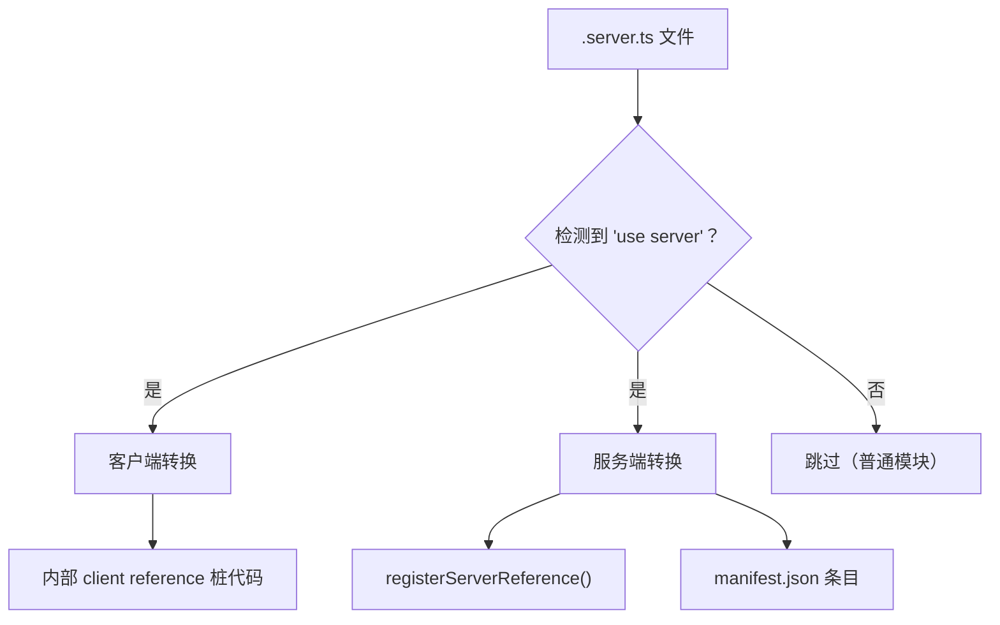

# 服务端函数

服务端函数允许你在与前端代码同源的地方编写后端逻辑，并在 React 组件中获得类似本地
async 函数调用的体验，但它本质上仍是类型安全的服务端边界。框架会序列化参数，
通过 framework server 分发请求，并返回序列化后的结果或结构化错误。虽然我们不强制要求，
但建议将服务端函数文件以 `.server.ts` 结尾。构建系统会自动将它们转换为 RPC 调用。

## 基本用法

```ts
// src/api/users.server.ts
"use server";

export async function getUsers() {
  return await db.users.findMany();
}

export async function createUser(name: string, email: string) {
  return await db.users.create({ data: { name, email } });
}

export const deleteUser = async (id: string) => {
  return await db.users.delete({ where: { id } });
};
```

### 规则

- 文件必须以 `"use server";` 指令开头
- 格式错误的 `"use server"` 模块会报告
  `Server function module could not be parsed:` 和 parser message；graph
  analysis 已知文件路径时，会在 server-function transform 运行前一并报告。
- 只有 **命名的可调用导出** 会被转换：`export function`、
  `export async function`、`export const name = () => {}`、
  `export const name = async () => {}`，或
  `export { saveUser as updateUser }` 这类同模块别名
- `"use server"` 模块必须至少导出一个命名 server function。如果模块只导出类型或
  本地 helper，请移除该指令，或导出可调用函数。
- Server function 可以返回普通值或 Promise；runtime 都会等待并返回结果。
  Generator 和 async-generator function 不受支持，因为它们返回 iterator，
  不是单个 transport 结果。
- 返回值和结构化的 `ServerError.data` 必须可以 JSON 序列化。返回
  `undefined` 是允许的，客户端代码会解析为 `undefined`；原始 HTTP 响应会序列化为空的成功 payload。
- 调用始终是异步的服务端边界调用。不要依赖 closure identity、同步副作用、
  class instance、DOM object、stream 或其他不可序列化引用跨越该边界。
- 导出别名可以使用 identifier 或字符串字面量名称，但本地绑定必须是函数声明，
  或初始化为函数的 `const`。字符串字面量别名不能为空，也不能带首尾空白。
  普通 TypeScript import 推荐使用 identifier 名称。
- `export type { UserInput }` 这类 type-only export 会被 runtime transform
  忽略，可以和 server function 放在同一个模块中。
- Ambient `declare` 导出不会产生运行时实现，因此不是 server function。
  每个导出的 server function 都必须有真实函数体。
- **推荐**：使用 `.server.ts` 扩展名（例如 `users.server.ts`）或将它们放在 `src/api/` 目录下，以帮助区分客户端代码。
- 不支持默认导出、跨模块 runtime re-export，也不支持导出常量等非函数 runtime 值
- 服务端函数需要 framework server。配置 `server: false` 时，任何可达的
  `"use server"` 模块都会成为构建错误。"可达" 指由 app、page 或 server entry
  import graph 导入；graph 外的无关文件会被忽略。

## 请求上下文 helper

Server function 运行在框架请求生命周期内，因此可以使用 `@evjs/server`
导出的请求 helper：

```ts
// src/api/session.server.ts
"use server";

import { getCookie, headers, request, waitUntil } from "@evjs/server";

export async function currentSession() {
  const req = request();
  const locale = headers().get("accept-language");
  const session = getCookie("session");

  waitUntil(auditSessionAccess(req.url));

  return { locale, hasSession: Boolean(session) };
}
```

这些 helper 只在 evjs 正在处理 server function、route handler、middleware、SSR
render、RSC Flight 请求或 PPR region 请求时可用。在模块顶层、构建阶段或客户端代码中调用会抛出：

```text
[evjs] Server context helpers (request(), headers(), cookie helpers, waitUntil()) must be called during a request lifecycle. Call them inside a server function, route handler, middleware, or framework render.
```

## 查询模式

evjs 提供类型安全的 `useQuery` 和 `useSuspenseQuery`，可直接接受服务端函数。服务端函数桩还携带 `.queryKey()`、`.fnId`、`.fnName`，以及固定签名下的 `.fnArity` 元信息，用于缓存失效和元信息获取。

### 直接使用（推荐）

```tsx
import {
  useQuery,
  useSuspenseQuery,
  useMutation,
  useQueryClient,
  getFnQueryKey,
  getFnQueryOptions,
} from "@evjs/client";
import { getUsers, getUser, createUser } from "../api/users.server";

// 查询 —— 直接传入服务端函数，类型自动推导
const { data: users } = useQuery(getUsers);               // data: User[]
const { data: user } = useQuery(getUser, userId);          // data: User
const { data } = useSuspenseQuery(getUsers);               // data: User[]（保证有值）

// 变更 —— 直接传入服务端函数，与 useQuery 用法一致
const queryClient = useQueryClient();
const { mutate } = useMutation(createUser, {
  onSuccess: () => {
    queryClient.invalidateQueries({ queryKey: getFnQueryKey(getUsers) });
  },
});

// 路由加载器 / 预取 —— 使用 getFnQueryOptions()
loader: ({ context }) =>
  context.queryClient.ensureQueryData(getFnQueryOptions(getUsers));
```

函数重载要求传入编译器生成的 server function stub，因为服务端边界需要稳定的函数 ID、
请求 endpoint 和 query key 元信息。把普通 async function 传给 `useQuery(fn)`、
`useSuspenseQuery(fn)`、`useMutation(fn)`、`getFnQueryKey(fn)` 或
`getFnQueryOptions(fn)` 时，会抛出带 `[evjs]` 前缀并指出被拒绝函数名称的诊断。
非 server function 请使用 TanStack object 形式，例如
`useQuery({ queryKey, queryFn })`。

### 服务端函数元信息

每个注册的服务端函数桩在运行时携带以下属性：

```ts
getFnQueryKey(getUsers)         // → ["<fnId>"]
getFnQueryKey(getUsers, someArg)// → ["<fnId>", someArg]
getUsers.fnId               // → "<hash>"（稳定的 SHA-256）
getUsers.fnName             // → "getUsers"
getUsers.fnArity            // → 固定签名的声明参数数量（存在时）
```

- **`getFnQueryKey(fn, ...args)`** — 构建 TanStack Query key。用于 `invalidateQueries`、`setQueryData` 等。
- **`.fnId`** — 稳定的内部函数 ID（只读）。
- **`.fnName`** — 可读的导出名称（只读）。
- **`.fnArity`** — 固定签名的声明参数数量（只读）。带 optional、default 或 rest 参数的签名会省略这个元信息，因为这些函数接受更灵活的参数形状。`useMutation()` 会在存在 `.fnArity` 时用它序列化变量。
- **`getFnQueryOptions(fn, ...args)`** — 返回 `{ queryKey, queryFn }`，用于加载器、预取和 `useInfiniteQuery`。

### 变更参数

```tsx
// 无参数：直接调用 mutate()
mutate();

// 单参数：直接传值；参数本身是数组时也直接传数组
mutate({ name: "Alice", email: "alice@example.com" });
mutate(["admin", "editor"]);

// 多参数：传入长度精确匹配的 tuple
mutate(["Alice", "alice@example.com"]);
```

固定签名会生成 `.fnArity`：

```ts
export async function refresh() {}                   // fnArity = 0
export async function saveRoles(roles: string[]) {}  // fnArity = 1
export async function createUser(name: string, email: string) {} // fnArity = 2
```

灵活签名会省略 `.fnArity`：

```ts
export async function search(query: string, options = {}) {}
export async function maybeUser(id?: string) {}
export const saveTags = async (...tags: string[]) => {};
```

当 `.fnArity` 被省略时，`useMutation()` 使用灵活 fallback：不传变量会变成
`[]`，数组变量会被当作完整参数列表，非数组变量会变成一个参数。如果数组本身应该作为
一个参数，请声明一个必填参数，例如上面的 `saveRoles()`。

调用 `useMutation(serverFn, options)` 时不要提供 `mutationFn`；evjs 会从服务端函数
推导它。只有非服务端函数才使用标准 TanStack 的 `useMutation({ mutationFn })`
对象形式。

## 传输配置

### HTTP（默认）

```tsx
import { initTransport } from "@evjs/client";
initTransport({
  // 可选，默认使用当前页面 origin。
  baseUrl: "https://api.example.com",
  // 跨域调用服务端函数时携带 cookie。
  credentials: "include",
  headers: { "x-app": "my-app" },
});
```

`baseUrl`、`credentials` 和 `headers` 用于配置内置 HTTP 适配器。函数路径本身
是由 `server.basePath` 派生的框架运行时元数据，所以应用代码通常只在服务端运行时
部署到另一个 origin 时配置 `baseUrl`：

- `baseUrl`：框架服务端调用的 absolute HTTP(S) origin 或 base URL；不能包含首尾空白字符。
- `credentials`：fetch credentials 策略，例如 `"include"`。
- `headers`：静态请求头，或每次调用时求值的函数。
  内置 adapter 会固定使用 `Content-Type: application/json`；该选项用于追加
  auth、tracing 或 CSRF token 等请求头。

Fetch `mode` 不提供配置。服务端函数请求使用浏览器默认 CORS 行为；跨域
cookie 应通过 `credentials` 和服务端 CORS 响应头配合控制。

默认 HTTP adapter 发送 POST JSON，形状是 `{ fnId, args }`，其中 `fnId` 是精确的
生成 server function ID，`args` 始终是数组。请求必须使用
`Content-Type: application/json`；缺失或其他 media type 会被框架 HTTP endpoint
以结构化 `415` 响应拒绝。其他 HTTP method 会收到带 `Allow: POST` 的结构化 `405`
响应。缺失、非字符串、空字符串或带首尾空白的 `fnId`，以及非数组的 `args`，都会在
dispatch 前以 `400` 拒绝。自定义 transport 即使不使用 HTTP，也应保持同样的逻辑契约。
框架 HTTP endpoint 会以同样的 `{ error, fnId, status }` JSON 结构拒绝超过 1 MiB 的
请求体，并返回 `413`。
默认 adapter 的网络错误或 abort 错误会作为 `ServerFunctionError` 抛出，
`status` 为 `0`，原始错误保留在 `cause` 中。
结构化 error envelope 只会从精确的 `application/json` 响应中识别，允许带
content-type 参数。
对于非 JSON 错误响应，adapter 会使用 trim 后的响应体作为错误消息；当响应体为空或
仅包含空白字符时，会回退到 `statusText`。
成功的 HTTP 响应也必须使用 `Content-Type: application/json`，默认 adapter
才会解析 `{ result }` payload。
默认 adapter 使用的 fetch shim 或测试替身必须返回类 Response 对象：成功响应需要
boolean `ok`、`headers.get("Content-Type")` 和 `json()`；错误响应还需要 number
`status`、string `statusText` 以及 `text()`。

### 自定义适配器（如 WebSocket）

实现 `TransportAdapter` 以使用自定义协议：

```tsx
import { initTransport } from "@evjs/client";
import type { TransportAdapter } from "@evjs/client";

const wsAdapter: TransportAdapter = {
  send: async (fnId, args) => {
    // 在这里实现你的 WebSocket 或自定义协议
  },
};

initTransport({ adapter: wsAdapter });
```

自定义适配器自行管理协议配置。传给 `send(fnId, args, context)` 的可选
`context` 只包含单次调用级别的值，目前是 `signal`。

## 错误处理

### 服务端

抛出带状态码和数据的结构化错误：

```ts
import { ServerError } from "@evjs/server";

export async function getUser(id: string) {
  const user = await db.users.findById(id);
  if (!user) {
    throw new ServerError("用户未找到", {
      status: 404,
      data: { id },
    });
  }
  return user;
}
```

### 客户端

捕获类型化错误：

```tsx
import { ServerFunctionError } from "@evjs/client";

try {
  const user = await getUser("123");
} catch (e) {
  if (e instanceof ServerFunctionError) {
    console.log(e.message);  // "用户未找到"
    console.log(e.status);   // 404
    console.log(e.data);     // { id: "123" }
  }
}
```

## 构建管道

在构建时，`"use server"` 指令触发两个独立的转换：



- **Graph analysis**：跟随 app、page 和 server entry import graph，
  校验并记录可达的 `"use server"` 模块。
- **Client build**：函数体会被替换为内部 client reference 桩代码。固定签名会携带 arity 元信息；optional、default 和 rest 参数签名会省略它。
- **Server build**：保留原始函数体，并注入 `registerServerReference()`。
- 函数 ID 是由 `filePath + exportName` 生成的稳定 SHA-256 hash。

运行时如果出现重复函数 ID，注册会失败，而不会覆盖之前的实现。这样可以在服务端启动时暴露
hash collision 或意外重复的 server-function metadata。

不支持的导出会在 bundler 运行前的 graph analysis 阶段报错。例如
`export default`、`export const VERSION = "1"` 和
`export declare function getUser()` 都不是合法 server function。
`export { getUser } from "./other"` 这类 runtime re-export 同样不受支持。

配置 `server: false` 时，graph analysis 会在这些转换前停止，并为可达的
server module 报出明确错误。此时应从 CSR graph 中移除该 import，或在
`ev.config.ts` 中启用 `server`。

## 要点总结

| 模式 | 用法 |
|------|------|
| 查询 | `useQuery(fn, ...args)` |
| Suspense 查询 | `useSuspenseQuery(fn, ...args)` |
| 变更 | `useMutation(fn)` 或 `useMutation(fn, { onSuccess })` |
| 缓存失效 | `getFnQueryKey(fn, ...args)` |
| 加载器 / 预取 | `getFnQueryOptions(fn, ...args)` → `{ queryKey, queryFn }` |
| 函数元信息 | `fn.fnId`、`fn.fnName`，固定签名下还有 `fn.fnArity` |
| 参数传递 | 展开传入：`useQuery(getUser, id)` 而不是 `useQuery(getUser, [id])` |
| 服务端错误 | 服务端 `ServerError` → 客户端 `ServerFunctionError` |
